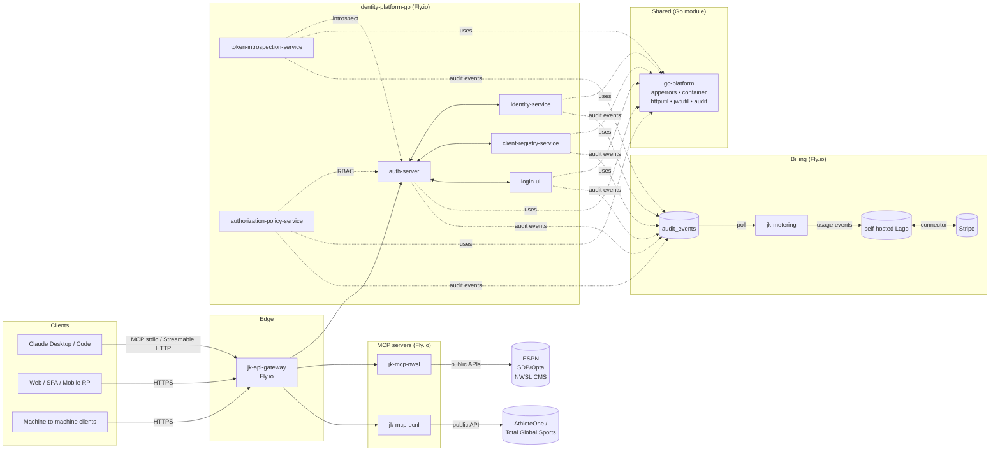

# Jedi Knights — Portfolio Architecture

A living architecture reference for the Jedi Knights service portfolio. Each project
below has its own deep-dive page under [`docs/`](docs/); this page is the map.

## Portfolio at a glance

| Project | Role | Language | Deploy target |
|---|---|---|---|
| [identity-platform-go](docs/identity-platform-go.md) | OAuth 2.1 / OIDC identity provider (7 services) | Go | Fly.io |
| [go-platform](docs/go-platform.md) | Shared Go library (errors, DI, HTTP, JWT, audit) | Go | Module registry |
| [jk-mcp-nwsl](docs/jk-mcp-nwsl.md) | MCP server for NWSL data | Python | Fly.io |
| [jk-mcp-ecnl](docs/jk-mcp-ecnl.md) | MCP server for ECNL / ECRL youth soccer | Python | Fly.io |
| [jk-metering](docs/jk-metering.md) | Audit-events → Lago metering shim | Go | Fly.io |
| [cross-cutting concerns](docs/cross-cutting.md) | Patterns shared across the portfolio | — | — |
| [agentic posture](docs/agentic-posture.md) | Gap analysis + phased roadmap against WSO2's reference model | — | — |
| [billing + metering setup](docs/billing-and-metering-setup.md) | Phase B prerequisite — self-hosted Lago + Stripe setup sequence | — | — |
| [operator runbook](docs/operator-runbook.md) | Concrete deployment runbook — Stripe, Lago on Fly.io, metering services, first SKUs, smoke test | — | — |

## System map

## How the pieces fit

- **`identity-platform-go`** issues, signs, validates, and revokes OAuth 2.1 / OIDC
  tokens. Its seven services are independently deployable; communication is
  synchronous HTTP and each service owns its data.
- **`go-platform`** is the shared Go library that every identity service depends on
  for structured errors, dependency injection, HTTP middleware, and JWT operations.
- **`jk-mcp-nwsl`** and **`jk-mcp-ecnl`** are read-only MCP servers that expose live
  soccer data to AI assistants. They share the same Python / FastMCP / hexagonal
  template and sit behind the same Fly.io gateway.
- The api-gateway (separate repo) fronts all public traffic, terminating TLS and
  enforcing rate limits, caching, and circuit-breaking before forwarding to the
  identity or MCP backends.
- **`jk-metering`** is the worker that completes the billing pipeline. Every
  identity service writes audit events through `go-platform/audit/durable` to a
  shared `audit_events` table; `jk-metering` polls the table, transforms each
  event into a Lago event, and posts to self-hosted Lago. Lago routes the
  resulting invoices to Stripe via its native connector.

## Reading order

1. **Start here** for a feel for the portfolio.
2. **[`docs/cross-cutting.md`](docs/cross-cutting.md)** explains the patterns
   repeated across every project (hexagonal architecture, MCP transport choices,
   Conventional Commits + semantic-release, Fly.io deploys).
3. **[`docs/agentic-posture.md`](docs/agentic-posture.md)** maps the portfolio
   onto an "agentic enterprise" reference model and tracks the phased roadmap
   to close the gaps.
4. The per-project pages are independent — open the one you need.

## Repo conventions

- Pure Markdown + Mermaid; no binary diagram sources. Mermaid renders natively in
  GitHub, in most IDEs, and is diff-friendly.
- Architecture pages reflect the source repos as of the latest survey. When a
  source ADR changes, the matching page is updated.
- ADR numbering follows the upstream repo (e.g., `identity-platform-go ADR 0008`)
  so cross-references remain stable.
