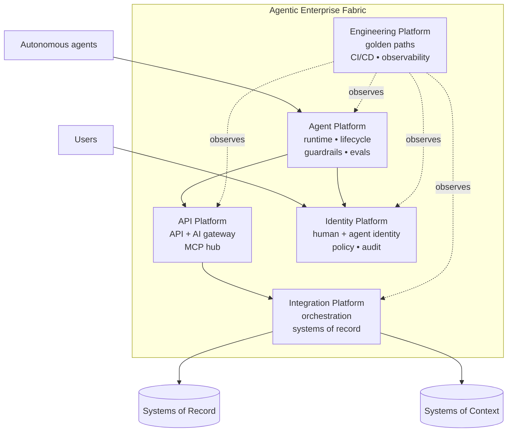
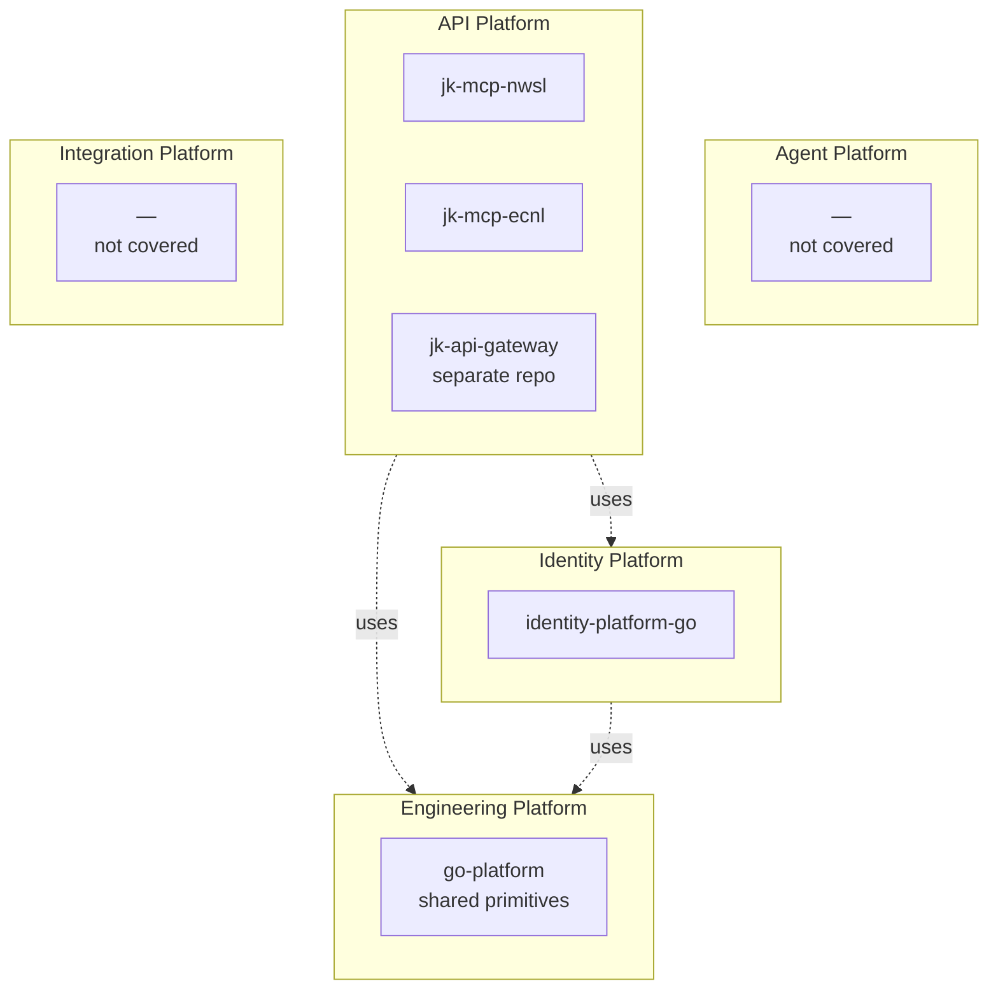
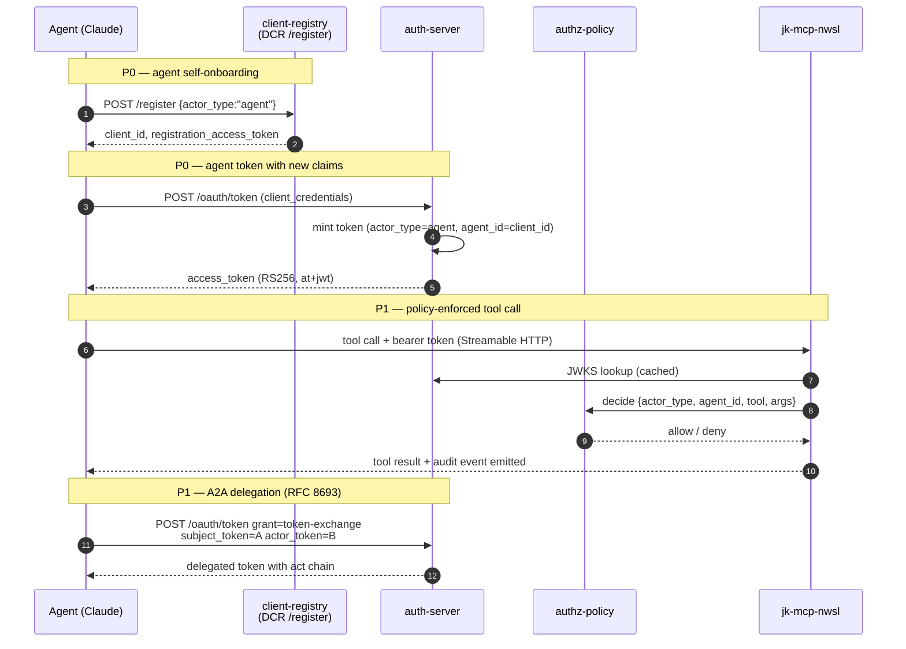

# Agentic posture

How this portfolio measures up against an "agentic enterprise" reference model,
where the gaps are, and how we close them.

The reference is WSO2's [Agentic Enterprise](https://wso2.com/library/blogs/agentic-enterprise-with-wso2/)
five-platform fabric. The terminology is WSO2's; the takeaways are
vendor-neutral and apply to any portfolio that wants to make autonomous AI
agents first-class actors alongside humans and services.

## What "agentic enterprise" means

A traditional enterprise architecture standardizes around three things:

- **Interfaces** (APIs)
- **Connectivity** (integration)
- **Guardrails** (identity, observability)

An agentic enterprise extends each of these for a new class of actor:

- Agents are **probabilistic**, not deterministic. Output quality must be
  evaluated, not just verified.
- Agents are **autonomous** — they decide which tools to call, in what order,
  with what arguments. The blast radius of a misbehaving agent dwarfs a
  misbehaving function.
- Agents have **their own identity** — separate from the human they may be
  acting on behalf of, and separate from the service that hosts them.
- Agents read and write **systems of context** (knowledge bases, vector stores)
  in addition to systems of record.

## The five-platform model

| Platform | Responsibility |
|---|---|
| **Agent Platform** | Agent runtime, lifecycle, guardrails, evaluations (LLM-as-judge) |
| **API Platform** | API + AI gateway, MCP hub, tool exposure |
| **Integration Platform** | Orchestration across systems of record, SaaS, partner APIs |
| **Identity Platform** | Human + agent identity, authentication, authorization, audit |
| **Engineering Platform** | Golden paths, CI/CD, observability spanning all of the above |

## Mapping the Jedi Knights portfolio onto the model

- **API Platform** — the MCP servers cover the "tools" half. `jk-api-gateway`
  (separate repo) is the gateway half.
- **Identity Platform** — `identity-platform-go` covers human and machine
  identity well; agent-specific identity is the gap.
- **Engineering Platform** — `go-platform` provides shared primitives (errors,
  DI, HTTP, JWT). Observability spanning agent → tool → upstream is the gap.
- **Agent Platform** — not covered.
- **Integration Platform** — not in scope for this portfolio.

## Gap matrix

| WSO2 capability | Status | Owning repo |
|---|---|---|
| Agent identity (distinct from human) | Missing — no `actor_type` claim | `identity-platform-go` |
| Scoped agent credentials | Partial — OAuth scopes exist; no agent semantics | `identity-platform-go` |
| Token Exchange (RFC 8693) for A2A delegation | Missing | `identity-platform-go` |
| Rich Authorization Requests (RFC 9396) | Missing | `identity-platform-go` |
| Dynamic Client Registration (RFC 7591/7592) | Designed (ADR-0013), impl pending | `identity-platform-go` |
| Authorization Server Metadata (RFC 8414) | Designed (ADR-0012), impl pending | `identity-platform-go` |
| MCP tool authorization (per-tool, per-agent) | Missing — tools fully open | `jk-mcp-nwsl`, `jk-mcp-ecnl` |
| Tool registry / MCP hub | Missing | new repo or via gateway |
| Policy enforcement on tool invocation | Missing | MCP servers + new shared lib |
| Agent-aware audit events | Partial — request logs only | all services + `go-platform` |
| LLM evaluation / agent test harness | Missing | MCP servers |
| End-to-end tracing (LLM ↔ agent ↔ tool ↔ system) | Missing — no OTel | `go-platform` + all services |
| Context graph / vector store / RAG | Missing | out of portfolio scope |
| Workflow orchestrator | Missing | out of portfolio scope |

Two rows are explicitly out of scope: the portfolio is read-only soccer data
and identity; we don't need a context graph or a workflow engine to claim
agent-readiness.

## Target architecture: agent identity flow

## Roadmap

Three phases. Each phase has a concrete acceptance criterion; we don't move on
until the criterion passes.

### P0 — foundations

Agents become a first-class principal type with audit trails.

**Work items:**

- `identity-platform-go` ADR-0015 (`actor_type`, `agent_id` claims) draft + implementation
- `go-platform/audit` package: structured event schema + first release
- `go-platform/otel` package: minimal OTel bootstrap + first release
- Audit wired into auth-server (every token issued / introspected emits an event)
- Confirm and finish ADR-0012 (`/.well-known`) and ADR-0013 (DCR) — agents
  cannot self-onboard without DCR

**Acceptance:** an OAuth client registered via DCR with `actor_type=agent`
obtains a token; every issuance and use of that token appears in a structured
audit log with `agent_id`.

### P1 — delegation + tool authorization

Agents can delegate, and MCP tool calls are policy-enforced.

**Work items:**

- ADR-0016 — Token Exchange (RFC 8693) with `act` chain
- ADR-0017 — Rich Authorization Requests (RFC 9396) for per-call permissions
- `jk-mcp-nwsl` Streamable HTTP requires bearer token; policy port wired
- `jk-mcp-ecnl` same changes
- Per-tool annotation extension (`sensitivity`, `cost_class`, `rate_limit_class`)
- OTel traces propagating from auth-server → MCP server → upstream API

**Acceptance:** agent A exchanges its token for a delegated token, the call
lands on `jk-mcp-nwsl` over Streamable HTTP, the MCP server consults
`authorization-policy-service`, the decision is audited, and a single OTel
trace shows the full chain (auth-server → MCP → ESPN).

### P2 — evaluation + registry

Agents are measured, registered centrally, and continuously evaluated.

**Work items:**

- ADR-0018 — agent audit event schema finalized; all services conform
- LLM-as-judge eval harness in each MCP server (`tests/evals/`)
- Nightly eval workflow publishes drift reports
- Decide: build MCP hub (separate repo) or defer
- This page closes: every gap-matrix row is "Present" or explicitly deferred

**Acceptance:** drift report shows pass/fail per tool per prompt; gap matrix
above has no "Missing" rows in scope; every "Partial" row has explicit rationale.

## Per-repo work items

### `architecture` (this repo)

- This page (delivered).
- Cross-links from `README.md`, `cross-cutting.md`, and the three project pages.
- Update phases as work lands in source repos.

### `identity-platform-go`

Four new ADRs, implemented in order:

| ADR | What | Status target by end of phase |
|---|---|---|
| 0015 | `actor_type` + `agent_id` claims | P0 |
| 0016 | RFC 8693 token exchange | P1 |
| 0017 | RFC 9396 rich authorization requests | P1 |
| 0018 | Agent audit event schema | P2 |

Also confirm — and finish if needed — ADR-0012 (`/.well-known`) and ADR-0013
(DCR). Both are designed; agents cannot self-onboard without both shipped.

### `go-platform`

Two new packages:

- **`audit`** — structured agent audit events. Fields: `event_type`,
  `actor_type`, `actor_id`, `subject_id`, `resource`, `action`, `decision`,
  `trace_id`, `correlation_id`, free-form `attrs`. Pluggable sinks (stderr
  JSON, OTel log, file). Used by identity services and (by mirror) MCP servers.
- **`otel`** — minimal OpenTelemetry bootstrap. Span helpers, context
  propagation, env-based exporter selection. Foundation for end-to-end traces.

Both ship under the existing semantic-release pipeline.

### `jk-mcp-nwsl` and `jk-mcp-ecnl`

Both servers share a template; changes mirror each other:

- **Authenticate the Streamable HTTP transport.** Verify bearer tokens via
  JWKS from `identity-platform-go`. Stdio transport remains unauthenticated
  (subprocess trust boundary).
- **Authorization port** (`ports/inbound/authorization.py`) consulted before
  every tool dispatch with `{actor_type, agent_id, tool_name, args}`. Adapter
  calls `authorization-policy-service`.
- **Extended tool annotations**: `sensitivity`, `cost_class`,
  `rate_limit_class` in addition to the current `readOnlyHint`.
- **Per-call audit events** matching the `go-platform/audit` schema.
- **LLM-as-judge eval harness** under `tests/evals/` — small set of reference
  prompts + expected tool sequences; nightly job replays against the deployed
  Fly instance and reports drift.

## Reusing what's already there

Most of this work composes onto existing primitives rather than replacing them:

- **`go-platform/jwtutil.Claims`** is extended (new claims are additive), not
  rewritten.
- **`go-platform/container`** wires the audit sink and OTel tracer as
  singletons.
- **`authorization-policy-service`** stays the policy engine — MCP servers
  call it through a new port. No new policy DSL.
- **`go-platform/httputil` middleware chain** (TraceID → Recovery → Logging)
  gains `AuthMiddleware` and `AuditMiddleware` in the same shape.
- The **`AdapterRetry(AdapterCache(HTTPAdapter))` composition pattern** in
  the MCP servers extends naturally to `AdapterAuthz` wrapping the inbound
  dispatcher.
- **Conventional Commits + semantic-release** continues to be the release
  vehicle for every new package and ADR.

## What's explicitly out of scope

- **Context graph / vector store / RAG.** The portfolio is read-only soccer
  data fetched on demand. No need for persistent semantic memory.
- **Workflow orchestrator (Temporal, BPMN).** No long-running multi-step
  agent workflows in scope.
- **Agent runtime / framework.** Claude (Desktop and Code) is the runtime;
  this portfolio is the tool + identity surface it consumes.

These are noted so the gap matrix above is honest: "missing" is not the same
as "needed."
