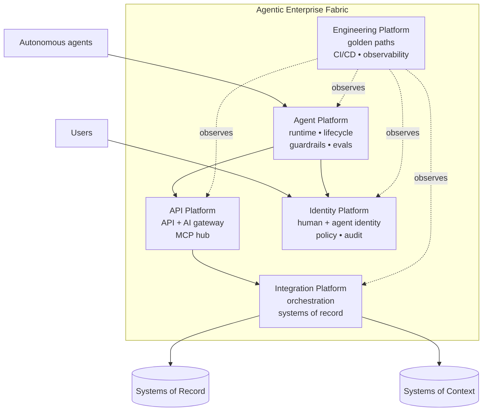
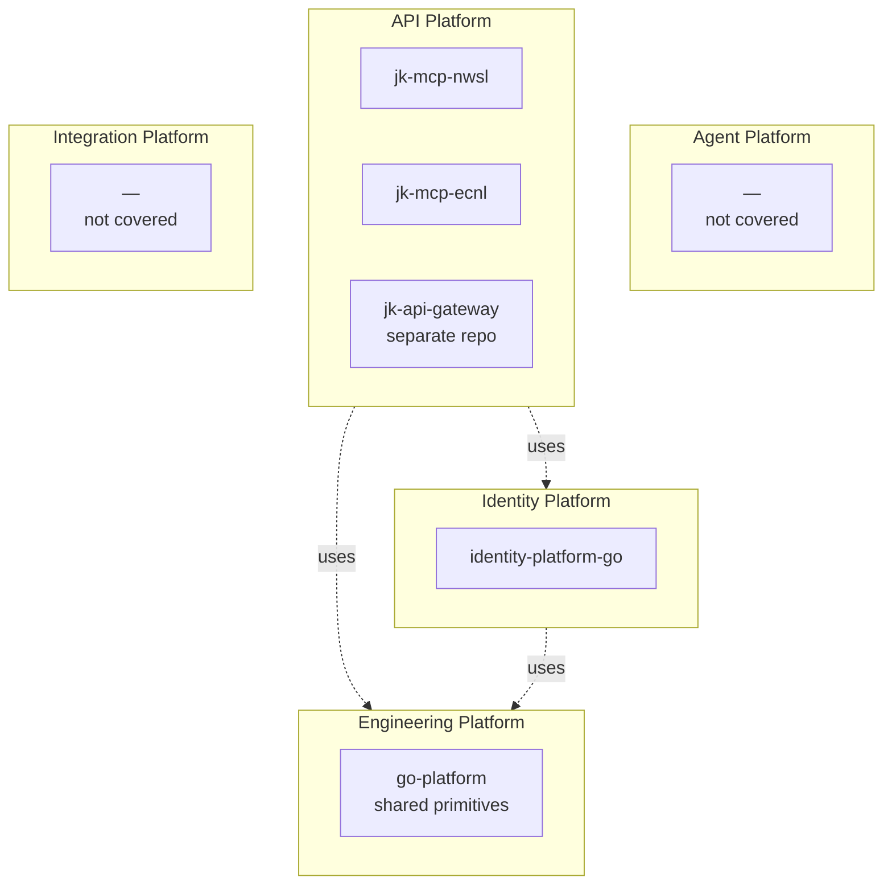
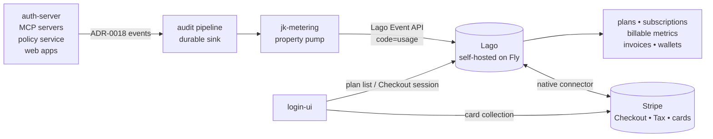
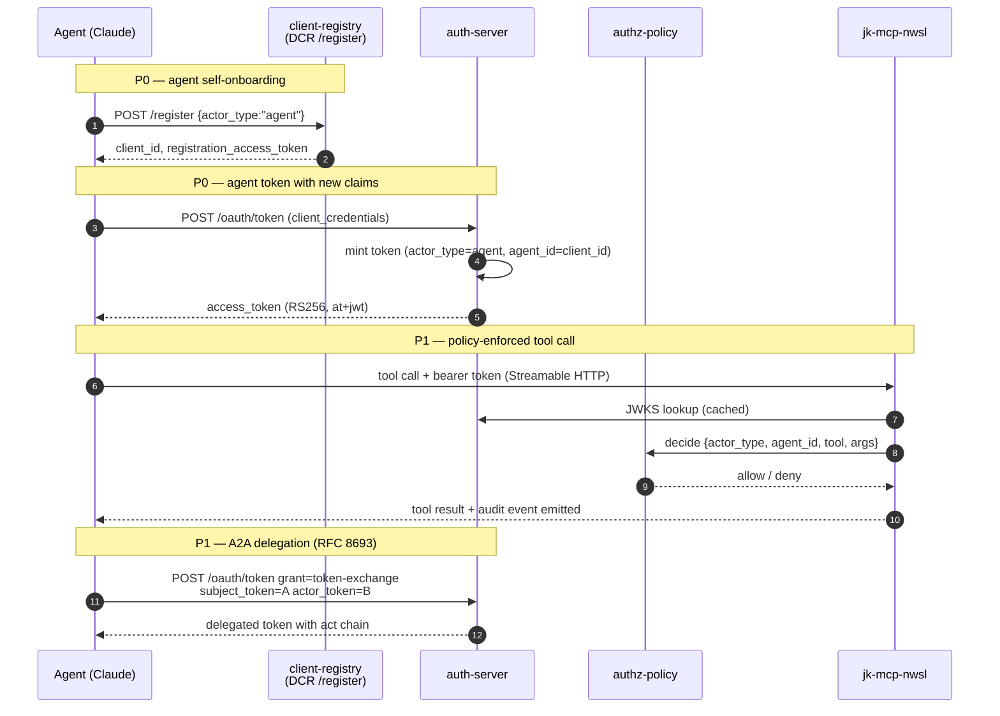

# Agentic posture

How this portfolio measures up against an "agentic enterprise" reference model,
where the gaps are, and how we close them.

The reference is WSO2's [Agentic Enterprise](https://wso2.com/library/blogs/agentic-enterprise-with-wso2/)
five-platform fabric. The terminology is WSO2's; the takeaways are
vendor-neutral and apply to any portfolio that wants to make autonomous AI
agents first-class actors alongside humans and services.

## What "agentic enterprise" means

A traditional enterprise architecture standardizes around three things:

- **Interfaces** (APIs)
- **Connectivity** (integration)
- **Guardrails** (identity, observability)

An agentic enterprise extends each of these for a new class of actor:

- Agents are **probabilistic**, not deterministic. Output quality must be
  evaluated, not just verified.
- Agents are **autonomous** — they decide which tools to call, in what order,
  with what arguments. The blast radius of a misbehaving agent dwarfs a
  misbehaving function.
- Agents have **their own identity** — separate from the human they may be
  acting on behalf of, and separate from the service that hosts them.
- Agents read and write **systems of context** (knowledge bases, vector stores)
  in addition to systems of record.

## The five-platform model

| Platform | Responsibility |
|---|---|
| **Agent Platform** | Agent runtime, lifecycle, guardrails, evaluations (LLM-as-judge) |
| **API Platform** | API + AI gateway, MCP hub, tool exposure |
| **Integration Platform** | Orchestration across systems of record, SaaS, partner APIs |
| **Identity Platform** | Human + agent identity, authentication, authorization, audit |
| **Engineering Platform** | Golden paths, CI/CD, observability spanning all of the above |

## Mapping the Jedi Knights portfolio onto the model

- **API Platform** — the MCP servers cover the "tools" half. `jk-api-gateway`
  (separate repo) is the gateway half.
- **Identity Platform** — `identity-platform-go` covers human and machine
  identity well; agent-specific identity is the gap.
- **Engineering Platform** — `go-platform` provides shared primitives (errors,
  DI, HTTP, JWT). Observability spanning agent → tool → upstream is the gap.
- **Agent Platform** — not covered.
- **Integration Platform** — not in scope for this portfolio.

## Gap matrix

| WSO2 capability | Status | Owning repo |
|---|---|---|
| Agent identity (distinct from human) | **Implemented** — `actor_type` + `agent_id` claims flow through every issued token (ADR-0015) | `identity-platform-go`, `go-platform/jwtutil` |
| Scoped agent credentials | **Implemented** — OAuth scopes + ADR-0015 `actor_type` + per-call RFC 9396 `authorization_details` granted-details (ADR-0017) | `identity-platform-go`, `go-platform/jwtutil` |
| Token Exchange (RFC 8693) for A2A delegation | **Implemented** — `urn:ietf:params:oauth:grant-type:token-exchange` grant on auth-server with `act` chain + depth cap + scope-subset enforcement (ADR-0016) | `identity-platform-go` |
| Rich Authorization Requests (RFC 9396) | **Implemented** — `authorization_details` accepted on `/oauth/token`, embedded on the issued JWT, echoed on introspection, advertised in metadata; type registry: `mcp_tool` + `resource` (ADR-0017) | `identity-platform-go` |
| Dynamic Client Registration (RFC 7591/7592) | **Implemented** — `POST /register` + `GET/PUT/DELETE /register/{id}` on client-registry-service (ADR-0013) | `identity-platform-go` |
| Authorization Server Metadata (RFC 8414) | **Implemented** — `/.well-known/oauth-authorization-server` + `/.well-known/openid-configuration` on auth-server (ADR-0012) | `identity-platform-go` |
| MCP tool authorization (per-tool, per-agent) | **Implemented** — RS256 bearer-token enforcement on streamable-http via `JWKSTokenVerifier`; per-tool annotations (`sensitivity`, `cost_class`, `rate_limit_class`) on every tool | `jk-mcp-nwsl`, `jk-mcp-ecnl` |
| Tool registry / MCP hub | Missing | new repo or via gateway |
| Policy enforcement on tool invocation | **Implemented** — inbound `Authorizer` port consulted before every tool dispatch; `PolicyServiceAuthorizer` calls `authorization-policy-service` `/evaluate` with fail-closed default | `jk-mcp-nwsl`, `jk-mcp-ecnl` + `authorization-policy-service` |
| Agent-aware audit events | **Implemented** — every paid surface emits ADR-0018 events; durable Postgres sink (ADR-0019) | `go-platform/audit`, all identity services |
| LLM evaluation / agent test harness | **Implemented** — scenario replay harness lands tool-dispatch + formatter regressions nightly on both MCP servers (`tests/evals/`, jk-mcp-nwsl PR #26, jk-mcp-ecnl PR #10); live-instance transport switch via `MCP_EVAL_REMOTE_URL` (jk-mcp-nwsl PR #27, jk-mcp-ecnl PR #11) opts scenarios in per-file via `live: true`; LLM-as-judge variant via `expected_judge` + Claude Haiku (jk-mcp-nwsl PR #28, jk-mcp-ecnl PR #12) grades semantic criteria PASS/FAIL when `ANTHROPIC_API_KEY` is set | `jk-mcp-nwsl`, `jk-mcp-ecnl` |
| End-to-end tracing (LLM ↔ agent ↔ tool ↔ system) | **Implemented** — every identity-platform service plus both MCP servers (jk-mcp-nwsl, jk-mcp-ecnl) emit traces; W3C `traceparent` propagates from auth-server through MCP to ESPN / AthleteOne | `go-platform` + all services |
| Egress control plane (outbound credentials, cost, DLP) | Deferred — start as a library, promote when triggered | `go-platform` → future `jk-egress-gateway` |
| Usage accounting / metering / billing | **Phase B (prerequisite, blocking further agentic work)** — self-hosted Lago + Stripe via the existing audit pipeline | identity-platform-go ADR-0019; [`jk-metering`](jk-metering.md); self-hosted Lago on Fly.io |
| Context graph / vector store / RAG | Missing | out of portfolio scope |
| Workflow orchestrator | Missing | out of portfolio scope |

Two rows are explicitly out of scope: the portfolio is read-only soccer data
and identity; we don't need a context graph or a workflow engine to claim
agent-readiness.

## Ingress vs egress

Today `jk-api-gateway` is the only gateway — fronting inbound traffic to
auth-server, the MCP servers, and any future identity-platform service. There
is **no dedicated egress gateway** because the outbound surface is narrow:
every upstream call goes to a public, unauthenticated, read-only data source.
The in-process `Retry(Cache(HTTP))` composition in each MCP server covers what
an egress gateway would otherwise enforce.

That changes as the portfolio grows. The triggers that warrant a separate
egress plane:

| Trigger | What egress would enforce |
|---|---|
| Paid LLM or model-routing API | Cost metering, key rotation, per-agent budget caps |
| Authenticated SaaS APIs (Stripe, Slack, GitHub) | Outbound credential vault, token refresh, scope audit |
| Tools that write to external systems | DLP scanning, per-action approval, blast-radius caps |
| Dynamic destinations from RFC 9396 `resource` details | Allowlist enforcement at one chokepoint, not N adapters |
| Compliance / audit of all outbound bytes by agent | Single audit point for outbound calls |

**Path forward.** Build the *policy shape* of an egress gateway as a library
first — put retry, circuit-break, OTel egress spans, and structured outbound
audit into `go-platform/httputil` (and the equivalent Python helper for the
MCP servers). Call sites speak the contract immediately and the cost of
promoting it later is mechanical rather than exploratory.

When the first trigger above lands, lift the library into a
`jk-egress-gateway` service that mirrors the ingress gateway shape — a single
chokepoint for outbound credentials, rate limits, and audit. The phased
roadmap below tracks the library step (P1) and reserves the gateway lift as
the first item past P2.

## Usage accounting

**Status: Phase B prerequisite.** Billing readiness blocks further agentic
capability work — the portfolio must be able to sell tool use, server use,
endpoint use, API use, web-application use, and feature use (à la carte or
bundled) before P0 through P2 land. The full design is in
**identity-platform-go ADR-0019**; the concrete deployment checklist is
**[`billing-and-metering-setup.md`](billing-and-metering-setup.md)**. This
section summarises the data plumbing rationale.

ADR-0018's audit envelope already carries every field a usage meter needs:

| Audit field | Accounting role |
|---|---|
| `actor_type` + `actor_id` | Who to bill / count against quota |
| `subject_id` | Bill the user even when an agent acted on their behalf |
| `resource` (e.g., `tool:get_standings`, `token:access`) | What was used — tool or endpoint |
| `action` | Verb of the use |
| `attrs.duration_ms`, `attrs.tokens_in/out`, `attrs.upstream_cost_usd` | Cost shaping when the unit isn't "one call" |
| `trace_id` | Reconciliation against OTel spans |

So audit + a downstream metering job = strict, per-user, per-agent,
per-tool, per-endpoint accounting. No parallel pipeline.

**Caveat.** ADR-0018 allows audit emission to *drop under overflow*
(non-blocking by design). Audit can be best-effort; metering cannot. When
metering ships, the audit pipeline gains a second sink with at-least-once
semantics — either a Postgres write on the request path or a persistent
broker (Kafka, NATS JetStream). The schema stays the same; only the sink
durability differs.

### When to build it

**Now.** Promoted from trigger-driven to **Phase B prerequisite** per
portfolio direction. The same triggers (paid LLM, per-cost quotas, usage
analytics) all apply, but the foundation ships in advance so subsequent
agentic work doesn't have to retrofit billing into already-deployed
surfaces.

### Architecture

Self-hosted [Lago](https://www.getlago.com) is the metering and invoicing
engine; [Stripe](https://stripe.com) is the payment processor (cards, tax,
dunning) plugged in via Lago's native connector. All customer and usage
data stays on portfolio infrastructure; Stripe sees only payment data and
card details (off our PCI scope via Stripe Checkout / Customer Portal).

Mapping audit fields to Lago primitives:

| Lago primitive | Source in this portfolio |
|---|---|
| **Event** (`code = "usage"`) | One per ADR-0018 audit event; the shim is a generic JSON property pump |
| **Billable metric** (`count`, `sum`, `latest`, `unique_count` + filters) | A SKU. Filters on `resource_kind`, `resource_parent`, `resource_path`, `event_type`, `actor_type` discriminate tools, servers, endpoints, APIs, web apps, features |
| **Plan / subscription** | A bundle (flat fee + quotas + overages) or pay-as-you-go shape |
| **Customer** | End user `subject_id` by default; per-plan override to `actor_id` or a tenant claim |
| **Invoices / wallets** | Lago defaults; pushed to Stripe via connector for payment |

What Lago and Stripe **do not** cover — stays in the portfolio:

- **Synchronous quota enforcement** at the request boundary lives in
  `authorization-policy-service` backed by a Redis counter. Lago reconciles
  totals on a schedule; it isn't a request-path quota oracle.
- **Real-time cost gates** ("stop this agent at $50/day") sit in the egress
  library, checked before the upstream call. Lago is the source of truth
  after the fact.
- **Per-call authorization decisions** stay with the policy engine.

See **[`billing-and-metering-setup.md`](billing-and-metering-setup.md)** for
the design-time walkthrough and
**[`operator-runbook.md`](operator-runbook.md)** for the concrete
deployment commands.

## Target architecture: agent identity flow

## Roadmap

Four phases. Each phase has a concrete acceptance criterion; we don't move on
until the criterion passes. **Phase B is a hard gate** — no P0–P2 work
ships until billing readiness is satisfied.

### Phase B — billing readiness (prerequisite)

Stand up the metering pipeline and the billing engine before adding
further agentic capability so every new capability can be sold from day
one without retrofit.

**Work items:**

- Deploy self-hosted Lago to Fly.io (Postgres + Redis sidecars)
- Connect a Stripe account; enable Stripe Checkout, Customer Portal,
  Stripe Tax; wire Lago's native Stripe connector
- Ship `go-platform/audit` with a `durable` sink (at-least-once Postgres
  or NATS JetStream)
- Extend ADR-0018 emitters with the resource taxonomy fields
  (`resource_kind`, `resource_id`, `resource_parent`, `resource_path`)
- Stand up [`jk-metering`](jk-metering.md) (the property-pump shim) and verify Lago event
  ingestion end to end
- Add the `/metering/events` ingestion endpoint for web apps and SPAs
- Wire `login-ui` plan selection + Stripe Checkout redirect
- Define the first billable metrics in Lago covering: one MCP tool, one
  full MCP server, one API endpoint, one whole API
- Define the first plans: Free, Starter (à la carte / pay-as-you-go),
  and Pro (bundle with included quotas)

**Acceptance:** a brand-new user signs up via login-ui → picks the
Starter plan → completes Stripe Checkout → makes an MCP tool call →
the call is metered, attributed to their `subject_id`, surfaces in Lago
as a `usage` event, and at the end of the cycle Lago generates an invoice
that Stripe charges and marks paid. Operators can add a new billable
metric or a new bundle in Lago admin without a portfolio release.

See `billing-and-metering-setup.md` for the concrete sequence.

### P0 — foundations ✅

Agents become a first-class principal type with audit trails. **Phase
complete as of 2026-06-27** — every work item below is merged on the
respective main branch.

**Work items:**

- ✅ `identity-platform-go` ADR-0015 (`actor_type`, `agent_id` claims) — `go-platform/jwtutil` PR #17, propagation PRs through auth-server / client-registry / identity-service
- ✅ `go-platform/audit` package: structured event schema + first release — `go-platform` PR #15
- ✅ `go-platform/audit/durable` Postgres-backed at-least-once sink — `go-platform` PR #16 (ADR-0019)
- ✅ `go-platform/otel` package: minimal OTel bootstrap + first release — `go-platform` PR #18
- ✅ Audit wired into every paid surface (auth-server, identity-service, client-registry-service, token-introspection-service, authorization-policy-service, login-ui)
- ✅ ADR-0012 RFC 8414 + OIDC Discovery metadata — `identity-platform-go` PR #83
- ✅ ADR-0013 RFC 7591 + RFC 7592 Dynamic Client Registration — `identity-platform-go` PRs #84 and #85

**Acceptance — met:** an OAuth client registered via DCR with `actor_type=agent`
obtains a token; every issuance and use of that token appears in a structured
audit log with `agent_id`. The metadata document advertises the registration
endpoint when the operator sets `AUTH_METADATA_REGISTRATION_ENDPOINT`, so an
agent's client library can bootstrap end-to-end from one issuer URL.

### P1 — delegation + tool authorization ✅

Agents can delegate, and MCP tool calls are policy-enforced. **Phase
complete as of 2026-06-28** — every work item below is merged on the
respective main branch.

**Work items:**

- ✅ ADR-0016 — Token Exchange (RFC 8693) with `act` chain — identity-platform-go PR #92
- ✅ ADR-0017 — Rich Authorization Requests (RFC 9396) for per-call permissions — identity-platform-go PR #99
- ✅ `jk-mcp-nwsl` Streamable HTTP requires bearer token — jk-mcp-nwsl PR #23
- ✅ `jk-mcp-ecnl` same change — jk-mcp-ecnl PR #7
- ✅ Inbound authorization port consulted on every tool dispatch — jk-mcp-nwsl PR #24, jk-mcp-ecnl PR #8
- ✅ Per-tool annotation extension (`sensitivity`, `cost_class`, `rate_limit_class`) — jk-mcp-nwsl PR #25, jk-mcp-ecnl PR #9
- ✅ OTel traces propagating from auth-server → MCP server → upstream API — every identity service plus both MCP servers wire the SDK; `JWKSTokenVerifier` propagates `actor_type` / `agent_id` claims through the trace context
- Egress concerns (retry, circuit-break, outbound audit, OTel egress spans) hardened in `go-platform/httputil` and mirrored in the MCP server template — partial; OTel + audit emission shipped, dedicated `jk-egress-gateway` deferred per the egress-trigger gate above

**Acceptance — met:** agent A's client_credentials grant can request
`authorization_details=[{type:"mcp_tool",tool:"get_standings"}]`, the
resulting token carries the claim, an exchanged token (RFC 8693) inherits
the granted-details, the streamable-http MCP server validates the JWT
via JWKS, the policy port consults `authorization-policy-service` with
the per-tool annotations on the request, and the full chain emits a
single OTel trace from `/oauth/token` issuance through MCP dispatch to
ESPN / AthleteOne.

**Carve-outs for P2 / follow-up:** `/oauth/authorize` (authorization_code grant)
RAR support — needs login-ui consent UI changes to render granted
details. Per-type schema validators for `mcp_tool` / `resource` types —
RFC 9396 leaves these to the deployment; this phase validates only the
type discriminator.

### P2 — evaluation + registry ✅

Agents are measured, registered centrally, and continuously evaluated.
**Phase complete as of 2026-06-28** — every work item below in scope
is merged; the MCP-hub decision is explicitly deferred to the
trigger-driven beyond-P2 list.

**Work items:**

- ✅ ADR-0018 — agent audit event schema finalized; every paid surface emits
- ✅ Scenario replay harness in each MCP server (`tests/evals/`) — jk-mcp-nwsl PR #26, jk-mcp-ecnl PR #10. YAML scenarios under `tests/evals/scenarios/` replay against an in-process MCP client with stubbed outbound ports, exercising the formatter and tool-dispatch chain hermetically.
- ✅ Nightly drift workflow publishes results — `.github/workflows/evals.yml` on both repos (09:00 / 09:15 UTC offsets so the AthleteOne / ESPN upstreams don't get hit simultaneously once promoted to live-instance replay)
- ✅ Live-instance replay via `MCP_EVAL_REMOTE_URL` — env-var-driven transport switch shipped on both MCP servers (jk-mcp-nwsl PR #27, jk-mcp-ecnl PR #11). Scenarios opt in via `live: true` so stub-only assertions don't drift into live runs; `MCP_EVAL_BEARER_TOKEN` forwarded when the deployment enforces auth.
- ✅ LLM-as-judge variant of `expected_contains` — `expected_judge` field on `Scenario` + Claude-backed grading shipped on both MCP servers (jk-mcp-nwsl PR #28, jk-mcp-ecnl PR #12). Default model `claude-haiku-4-5-20251001` (overridable via `MCP_EVAL_JUDGE_MODEL`); judge tests skip cleanly when `ANTHROPIC_API_KEY` is unset, so contributor PR runs without the key stay green.
- Decide: build MCP hub (separate repo) or defer — **deferred** to the trigger-driven beyond-P2 list (no third MCP server yet, no dynamic destination requirement).

**Acceptance — met:** drift report shows pass/fail per tool per
prompt across two assertion modes (substring + semantic) and two
transports (in-process + Streamable HTTP to a remote URL); the
gap matrix above has no in-scope "Missing" rows; every "Partial"
row carries an explicit rationale.

### Beyond P2 — trigger-driven additions

These items aren't on a calendar — they ship when the corresponding trigger
in the [Ingress vs egress](#ingress-vs-egress) table fires:

- **`jk-egress-gateway`** — promote the egress library into a dedicated
  service. Single chokepoint for outbound credentials, per-agent rate limits,
  DLP scanning, and outbound audit. Mirrors `jk-api-gateway` shape.
- **MCP hub / tool registry** — separate repo cataloging MCP endpoints + tool
  schemas + per-tool policies. Only needed once a third MCP server lands or
  agents start choosing destinations dynamically.
- **Context graph / RAG layer** — only if tools graduate from read-on-demand
  to persistent semantic memory.

## Per-repo work items

### `architecture` (this repo)

- This page (delivered).
- Cross-links from `README.md`, `cross-cutting.md`, and the three project pages.
- Update phases as work lands in source repos.

### `identity-platform-go`

Four new ADRs, implemented in order:

| ADR | What | Status |
|---|---|---|
| 0012 | RFC 8414 + OIDC Discovery metadata | ✅ Shipped (PR #83) |
| 0013 | RFC 7591 + RFC 7592 DCR | ✅ Shipped (PRs #84 + #85) |
| 0015 | `actor_type` + `agent_id` claims | ✅ Shipped (P0) |
| 0016 | RFC 8693 token exchange | ✅ Shipped (PR #92) |
| 0017 | RFC 9396 rich authorization requests | ✅ Shipped (PR #99) |
| 0018 | Agent audit event schema | ✅ Shipped (every paid surface emits) |

### `go-platform`

Two new packages:

- **`audit`** — structured agent audit events. Fields: `event_type`,
  `actor_type`, `actor_id`, `subject_id`, `resource`, `action`, `decision`,
  `trace_id`, `correlation_id`, free-form `attrs`. Pluggable sinks (stderr
  JSON, OTel log, file). Used by identity services and (by mirror) MCP servers.
- **`otel`** — minimal OpenTelemetry bootstrap. Span helpers, context
  propagation, env-based exporter selection. Foundation for end-to-end traces.
- **`httputil` extension — egress policy primitives.** Retry, circuit-break,
  outbound audit, and OTel egress spans hardened in the same chain shape as
  the existing inbound middleware. Lets services speak the egress-gateway
  contract today even though the gateway itself doesn't exist yet.

Both new packages and the `httputil` extension ship under the existing
semantic-release pipeline.

### `jk-mcp-nwsl` and `jk-mcp-ecnl`

Both servers share a template; changes mirror each other:

- **Authenticate the Streamable HTTP transport.** Verify bearer tokens via
  JWKS from `identity-platform-go`. Stdio transport remains unauthenticated
  (subprocess trust boundary).
- **Authorization port** (`ports/inbound/authorization.py`) consulted before
  every tool dispatch with `{actor_type, agent_id, tool_name, args}`. Adapter
  calls `authorization-policy-service`.
- **Extended tool annotations**: `sensitivity`, `cost_class`,
  `rate_limit_class` in addition to the current `readOnlyHint`.
- **Per-call audit events** matching the `go-platform/audit` schema.
- **Scenario replay harness** under `tests/evals/` — YAML scenarios replay
  against an in-process MCP client with stubbed outbound ports so the formatter
  + tool-dispatch chain is exercised hermetically; nightly drift workflow runs
  on schedule. Setting `MCP_EVAL_REMOTE_URL` switches the transport to
  Streamable HTTP against the deployed Fly instance; scenarios marked
  `live: true` participate. Scenarios with `expected_judge` criteria are
  graded by Claude (Haiku 4.5 by default) PASS/FAIL when
  `ANTHROPIC_API_KEY` is set — the semantic backstop for outputs whose
  exact phrasing is too brittle to assert on with substrings.

## Reusing what's already there

Most of this work composes onto existing primitives rather than replacing them:

- **`go-platform/jwtutil.Claims`** is extended (new claims are additive), not
  rewritten.
- **`go-platform/container`** wires the audit sink and OTel tracer as
  singletons.
- **`authorization-policy-service`** stays the policy engine — MCP servers
  call it through a new port. No new policy DSL.
- **`go-platform/httputil` middleware chain** (TraceID → Recovery → Logging)
  gains `AuthMiddleware` and `AuditMiddleware` in the same shape.
- The **`AdapterRetry(AdapterCache(HTTPAdapter))` composition pattern** in
  the MCP servers extends naturally to `AdapterAuthz` wrapping the inbound
  dispatcher.
- **Conventional Commits + semantic-release** continues to be the release
  vehicle for every new package and ADR.

## What's explicitly out of scope

- **Context graph / vector store / RAG.** The portfolio is read-only soccer
  data fetched on demand. No need for persistent semantic memory.
- **Workflow orchestrator (Temporal, BPMN).** No long-running multi-step
  agent workflows in scope.
- **Agent runtime / framework.** Claude (Desktop and Code) is the runtime;
  this portfolio is the tool + identity surface it consumes.

These are noted so the gap matrix above is honest: "missing" is not the same
as "needed."
