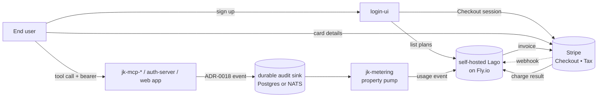

# Billing + metering setup

How to bring the Phase B billing readiness gate online: self-hosted
[Lago](https://www.getlago.com) for metering and invoicing, [Stripe](https://stripe.com)
for payment processing. Concrete sequence; no rationale (see
[`agentic-posture.md`](agentic-posture.md#usage-accounting) and
`identity-platform-go` ADR-0019 for that).

> **Status:** all the code in this sequence is now merged. Use
> **[`operator-runbook.md`](operator-runbook.md)** for the concrete
> commands to deploy and configure. This page is the design-time
> walkthrough; the runbook is the execution checklist.

## End-to-end picture



## Prerequisites

- Fly.io org with credit-card on file (managed Postgres + Redis volumes
  required for Lago)
- Stripe account in live mode (test mode for non-prod environments)
- A Stripe restricted-API key with permissions for:
  Customers (write), PaymentMethods (read/write), PaymentIntents
  (read/write), Invoices (read/write), Webhooks (read)
- Existing identity-platform-go deployment with ADR-0008 (RS256+JWKS)
  shipped — audit emitters depend on it
- `go-platform/audit` and `go-platform/otel` released (Phase B sub-step
  before everything else here)

## Sequence

### 1. Deploy self-hosted Lago

Lago ships as Docker images. Three apps on Fly.io:

| Fly app | Image | Notes |
|---|---|---|
| `lago-api` | `getlago/api:latest` | The Rails API server; the only public ingress (behind `jk-api-gateway`) |
| `lago-front` | `getlago/front:latest` | Admin UI; internal-only |
| `lago-worker` | `getlago/api:latest` (different entrypoint) | Async billing jobs |

Backing services:

- **Lago Postgres** — Fly Managed Postgres, separate cluster from
  identity-platform's (different schema lifecycle).
- **Lago Redis** — Fly Managed Redis or Upstash. Used for Sidekiq queues
  and rate limiting.

Critical Fly secrets:

```
LAGO_RSA_PRIVATE_KEY      # generated once, used to sign invoices
LAGO_FROM_EMAIL           # invoices arrive from this address
LAGO_LICENSE              # if using a paid plan; omit for OSS
DATABASE_URL              # Lago Postgres
REDIS_URL                 # Lago Redis
ENCRYPTION_PRIMARY_KEY    # for at-rest encryption of secrets in Lago
ENCRYPTION_DETERMINISTIC_KEY
ENCRYPTION_KEY_DERIVATION_SALT
```

Route `https://billing.<your-domain>` to `lago-front` via the gateway
for the admin UI; route `https://api.billing.<your-domain>` to `lago-api`
for the API.

Smoke test: `curl https://api.billing.<your-domain>/health` returns 200.

### 2. Configure Stripe + connector

1. In the Stripe Dashboard, enable: **Checkout**, **Customer Portal**,
   **Stripe Tax**, **Invoices**.
2. Configure Stripe Customer Portal — allow card updates, invoice
   history, subscription cancellation per business rules.
3. Configure a webhook endpoint pointing at
   `https://api.billing.<your-domain>/webhooks/stripe`. Subscribe to:
   - `checkout.session.completed`
   - `invoice.payment_succeeded`
   - `invoice.payment_failed`
   - `customer.subscription.updated`
   - `customer.subscription.deleted`
4. In Lago admin (`https://billing.<your-domain>`):
   **Settings → Integrations → Add Stripe** with the restricted API key
   and webhook secret. Lago tests the connection and persists the
   credentials encrypted.

Smoke test: create a Lago customer with a test email; confirm the
matching Stripe customer auto-creates.

### 3. Ship the durable audit sink

Land `go-platform/audit` with both sinks:

- `stderr_json` — existing best-effort
- `durable` — new; writes to a Postgres table or NATS JetStream subject
  with synchronous ack

Configuration (env, per service):

```
AUDIT_SINKS=stderr_json,durable
AUDIT_DURABLE_BACKEND=postgres        # or "nats"
AUDIT_DURABLE_DSN=postgres://...      # writes to audit_events table
AUDIT_DURABLE_REQUIRED=true           # fail the request on sink error
                                       # for paid event types
```

Migration adds the `audit_events` table to whichever Postgres the audit
sink targets (separate from Lago's database). One service per Postgres
is fine; a shared audit Postgres works too.

### 4. Extend the audit envelope (ADR-0018 + ADR-0019 fields)

Update every emitter to populate the resource taxonomy:

```go
audit.Emit(ctx, audit.Event{
    EventType:       "tool_invoked",
    Service:         "jk-mcp-nwsl",
    Resource:        "tool:get_standings",
    ResourceKind:    "tool",
    ResourceID:      "get_standings",
    ResourceParent:  "jk-mcp-nwsl",
    ResourcePath:    "jk-mcp-nwsl/tool/get_standings",
    // ... actor, action, decision, attrs
})
```

For Python MCP servers, mirror via structlog with identical field names.

### 5. Stand up `jk-metering`

Scaffolded at [`jedi-knights/jk-metering`](https://github.com/jedi-knights/jk-metering)
(see [`jk-metering.md`](jk-metering.md) for the architecture page). A
small Go worker that:

- Polls the `audit_events` table (`WHERE consumed_at IS NULL ORDER BY
  created_at ASC LIMIT N`); `LISTEN/NOTIFY` is a deferred optimisation
- Transforms each event into one Lago event with `code = "usage"`, all
  fields flattened to Lago properties
- Maps `external_subscription_id` from a configurable audit field
  (`subject` / `actor` / `client`)
- Pushes via Lago's `POST /api/v1/events`
- Marks `consumed_at` on success; combined with the ULID
  `transaction_id` Lago dedupes on, the pipeline is exactly-once
  at-rest from emission through billing

Deploy as a Fly worker (no public HTTP). The repo includes a
`Dockerfile` and `fly.toml` configured for one always-on
`shared-cpu-1x` machine.

Smoke test: emit a synthetic `tool_invoked` event from a backend service;
confirm a matching Lago event lands within `METERING_METERING_POLL_INTERVAL_SECONDS`.

### 6. Metering ingestion endpoint for web apps

New endpoint `POST /metering/events` lives either in `auth-server` or
in a small `jk-metering-ingest` service (decide at implementation time).
Contract per ADR-0019:

- Bearer-token authentication (RS256 via JWKS)
- Server overrides trusted fields (`actor_type`, `actor_id`,
  `subject_id`, `service`, `trace_id`, `event_id`, `timestamp`) from the
  token + server context
- Client supplies `event_type`, `resource_kind`, `resource_id`,
  `resource_parent`, `resource_path`, `attrs`
- Authorization-policy scope `metering:emit:<resource_parent>` required

Smoke test: a curl with a valid user token emits a `feature_used`
event; confirm it lands in Lago with the expected `resource_path`.

### 7. login-ui plan selection + Stripe Checkout

Add three flows to login-ui:

| Flow | Endpoint | Behavior |
|---|---|---|
| **List plans** | `GET /billing/plans` | Calls Lago `GET /plans`; renders a plan picker |
| **Start checkout** | `POST /billing/checkout` | Calls Lago to create a Stripe Checkout Session; redirects user |
| **Manage subscription** | `GET /billing/portal` | Calls Stripe to create a Customer Portal session; redirects |

Cache plan listings in login-ui with a short TTL (30–60 s) so a Lago
outage doesn't break sign-in.

### 8. Define the first billable metrics + plans

In Lago admin, create:

**Billable metrics** (initial set covering the requested SKU shapes):

| Code | Aggregation | Filters |
|---|---|---|
| `mcp_tool_call` | count | `event_type = tool_invoked` |
| `nwsl_server_use` | count | `resource_parent = jk-mcp-nwsl` |
| `ecnl_server_use` | count | `resource_parent = jk-mcp-ecnl` |
| `nwsl_standings_lookups` | count | `resource_path = jk-mcp-nwsl/tool/get_standings` |
| `auth_token_issuance` | count | `resource_kind = token` AND `action = issue` |
| `auth_server_use` | count | `resource_parent = auth-server` |
| `webapp_session` | count | `resource_kind = application` |
| `webapp_feature_use` | count | `resource_kind = feature` |

**Plans**:

- **Free** — $0/mo; included quotas for each billable metric; no overage
- **Starter (à la carte / PAYG)** — $0/mo; per-unit prices on selected
  metrics; no minimums
- **Pro (bundle)** — flat fee/mo; generous included quotas; overage at
  Starter pricing

Adding new bundles, changing prices, adding a new metric for a new SKU
shape — all configuration in this UI; no portfolio release.

### 9. End-to-end smoke

The Phase B acceptance scenario:

1. New email signs up via login-ui → identity-service creates the user
2. login-ui prompts plan selection; user picks **Starter**
3. login-ui redirects to Stripe Checkout; user enters a test card
4. Stripe webhook → Lago provisions the subscription
5. User obtains an access token from auth-server with their `subject_id`
6. User (or their agent) calls `get_standings` on `jk-mcp-nwsl` over
   Streamable HTTP with the bearer token
7. The MCP server emits a `tool_invoked` audit event with full resource
   taxonomy
8. `jk-metering` picks it up; pushes to Lago as a `usage` event
9. Lago billable metrics aggregate the event under `mcp_tool_call`,
   `nwsl_server_use`, and `nwsl_standings_lookups`
10. End of billing cycle → Lago generates invoice → pushes to Stripe →
    Stripe charges the test card → webhook → Lago marks paid

Verifies: durable sink, resource taxonomy, metering shim, Lago plan
config, Stripe connector, subscription flow, and end-user attribution.

## Reference materials

- ADR-0019 — full design with consequences, alternatives, and the
  flexibility-commitment table
- ADR-0018 — audit event schema (extended by ADR-0019's resource
  taxonomy)
- `agentic-posture.md` — Phase B gate, ingress/egress story, gap matrix
- [Lago getting started](https://docs.getlago.com/getting-started/)
- [Lago Stripe connector](https://docs.getlago.com/integrations/payment-providers/stripe)
- [Stripe Checkout](https://stripe.com/docs/payments/checkout) and
  [Stripe Customer Portal](https://stripe.com/docs/customer-management)
