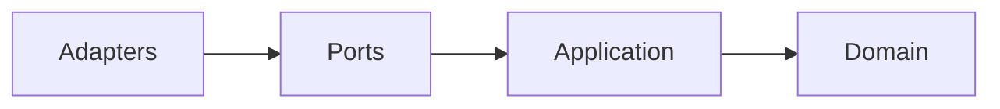

# Cross-cutting concerns

Patterns that appear in more than one project. Linked from every per-project page
so the rationale lives in one place.

## Hexagonal architecture

Every backend in this portfolio follows ports-and-adapters with the same layer
order and dependency direction:



- **Domain** — pure business models and interfaces. No framework imports.
- **Application** — orchestration and use cases. Depends only on domain types.
- **Ports** — inbound (HTTP, MCP, CLI) and outbound (DB, sibling service, upstream API) interfaces.
- **Adapters** — concrete implementations behind those ports.

Concrete instantiations:

| Project | Domain layer | Adapter examples |
|---|---|---|
| identity-platform-go | `internal/domain/` per service | HTTP handlers, Postgres / Redis / in-memory repos, inter-service HTTP clients |
| jk-mcp-nwsl | `src/nwsl/domain/` | FastMCP inbound; ESPN / SDP / CMS HTTP adapters wrapped in retry + cache |
| jk-mcp-ecnl | `src/ecnl/domain/` | FastMCP inbound; AthleteOne HTTP adapter wrapped in retry + cache; discovery walker |

`identity-platform-go` enforces the contract at compile time
(`var _ domain.X = (*X)(nil)` at every adapter); the Python projects rely on
`Protocol` interfaces and type-checked tests.

### Adapter composition over middleware

Both MCP servers layer cross-cutting concerns by *wrapping* adapters rather than
chaining middleware:

```
CachingAdapter( RetryAdapter( HTTPAdapter ) )
```

Each layer implements the same port interface. Behavior is added by composition,
not by a separate pipeline framework. Same principle as the Go middleware chain
in `go-platform/httputil` — different mechanic.

## Deployment: Fly.io

Every deployable service in the portfolio runs on Fly.io.

| Property | Choice | Why |
|---|---|---|
| Container build | Project `Dockerfile`, `flyctl deploy --remote-only` | No registry plumbing; image builds on Fly's infra (no Docker-in-Docker in CI) |
| Trigger | semantic-release tag → GitHub Action | Releases are the deploy trigger |
| Scale-to-zero | `min_machines = 0` for stateless / low-traffic services | Free tier-friendly |
| TLS termination | api-gateway at the edge | Backend services run plaintext on the private network (Flycast) |

The MCP servers and identity services share this same shape — the deployment
model is uniform regardless of language.

## API gateway

`jk-api-gateway` (separate repo) sits in front of every public-facing service:

- TLS termination
- Rate limiting (multiple strategies: token bucket, sliding window, leaky bucket, concurrency)
- Caching
- Circuit breaking
- Path-based routing — e.g., `/mcp/ecnl/*` → jk-mcp-ecnl, `/oauth/*` → auth-server

Backend services don't expose public IPs; they're reachable only via Flycast on
the private network.

### Ingress today, egress later

The portfolio runs a single (ingress) gateway because every outbound call goes
to a public, unauthenticated, read-only source today. A dedicated egress
gateway is planned once any of these land: paid LLM APIs, authenticated SaaS
APIs, tools that write to external systems, or RFC 9396 `resource` types that
let agents choose destinations dynamically. Until then, the egress contract
(retry, circuit-break, outbound audit, OTel egress spans) lives as a library
in `go-platform/httputil` so call sites already speak the future
gateway's shape. See
[`agentic-posture.md`](agentic-posture.md#ingress-vs-egress) for the trigger
list and migration path.

## MCP transports

Both MCP servers support the same two transports, switched by `MCP_TRANSPORT`:

| Transport | Mechanism | When used |
|---|---|---|
| `stdio` | Subprocess; JSON-RPC over stdin/stdout | Claude Desktop / Code spawns the server locally |
| `streamable-http` | HTTP on a configured port | Hosted instance behind the gateway |

In stdio mode, *nothing* may write to stdout except the JSON-RPC stream. Both
servers use a JSON log formatter that emits to stderr to keep the protocol clean.

DNS-rebinding and Origin-header validation are configured via
`MCP_ALLOWED_HOSTS` and `MCP_ALLOWED_ORIGINS`, defaulting to `https://claude.ai`
and `https://claude.com`.

## Conventional Commits + semantic-release

Every repo uses Conventional Commits as the source of truth for versioning:

| Commit type | Bump |
|---|---|
| `feat:` | minor |
| `fix:` / `perf:` / `refactor:` | patch |
| `feat!:` or `BREAKING CHANGE:` footer | major |
| `docs:` / `chore:` / `ci:` / `style:` / `test:` | none |

Scopes name the affected package (`feat(jwtutil): ...`, `fix(client-registry): ...`).
semantic-release reads the history, computes the bump, writes the changelog,
tags, and triggers the deploy workflow.

`identity-platform-go` (Go workspace, multi-module) versions each module
independently — a change to a shared library propagates a patch release to every
service that depends on it, even when those services have no new code of their own.

## Testing

| Project | Stack | Floor |
|---|---|---|
| identity-platform-go | `go test`, gomock, BDD via `godog` | per-module gate |
| go-platform | `go test`, coverage gate | — |
| jk-mcp-nwsl | `pytest` + `pytest-asyncio` + `pytest-bdd` | ≥ 90% (currently 91%) |
| jk-mcp-ecnl | `pytest` + `pytest-asyncio` + `pytest-bdd` | ≥ 90% (currently 92.5%) |

Python projects also enforce cyclomatic complexity ≤ 7 (`py-cyclo`) and `ruff`
lint + format in CI.

## Quality gates summary

| Gate | Scope |
|---|---|
| Conventional Commits | All repos |
| semantic-release | All repos |
| Lint / format | Per-language (`golangci-lint`, `ruff`) |
| Test coverage | Floor per project (~90% on Python; per-module on Go) |
| Cyclomatic complexity | Python projects (≤ 7) |
| Compile-time interface checks | Go services (`var _ Port = (*Adapter)(nil)`) |
| `typ` header enforcement on JWTs | `go-platform/jwtutil`, used by identity services |

## Agent identity and tool authorization

The portfolio is being extended so autonomous AI agents are first-class
principals — distinct from human users and machine clients — with scoped
credentials, policy-enforced tool access, and end-to-end audit. The gap
analysis and phased roadmap live in [`agentic-posture.md`](agentic-posture.md).

In short:

- **Identity** — `identity-platform-go` will distinguish agent principals via
  `actor_type=agent` + `agent_id` claims (ADR-0015), support agent-to-agent
  delegation via token exchange (ADR-0016, RFC 8693), and per-call fine-grained
  permissions via RAR (ADR-0017, RFC 9396).
- **Tool authorization** — both MCP servers will gain a policy port on the
  Streamable HTTP transport that consults `authorization-policy-service`
  before every tool dispatch.
- **Observability** — new `go-platform/audit` and `go-platform/otel` packages
  give every service a single audit-event schema and end-to-end traces from
  token issuance through tool call to upstream API.

## Privacy / submission posture (MCP servers)

Both MCP servers are submitted to the Anthropic Software Directory and follow
the same posture:

- No personal data collected, no accounts, no API keys.
- Cache is in-process, ephemeral, evicted on restart.
- Fly.io logs contain tool name + status + error — no request bodies.
- Every tool is annotated `readOnlyHint = true`.
- `PRIVACY.md` documents collection, usage, storage, retention, and contact.
