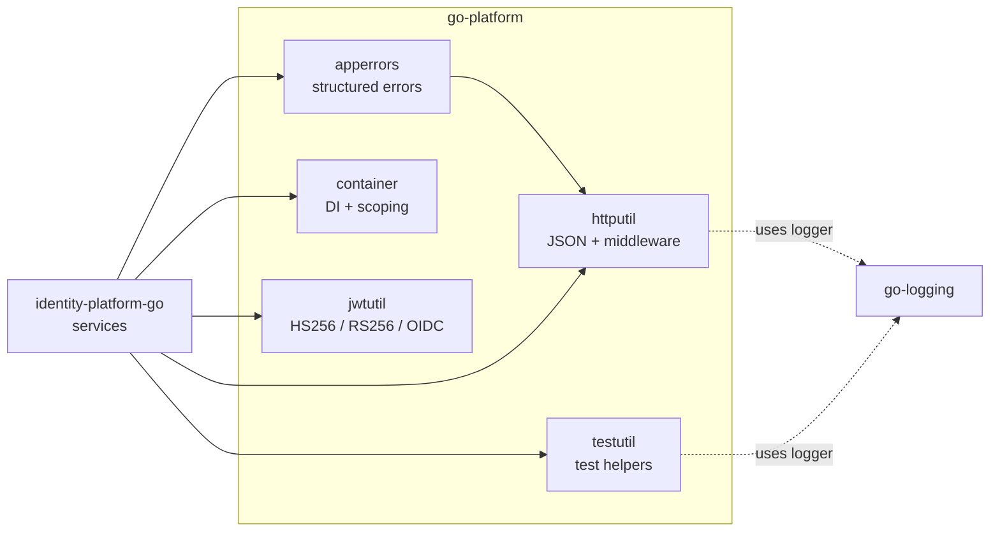

# go-platform

A small, stdlib-preferring Go library that supplies the structural foundations
every Jedi Knights Go service depends on: structured errors, dependency injection,
HTTP responses + middleware, and JWT operations.

- **Repo:** [`jedi-knights/go-platform`](https://github.com/jedi-knights/go-platform)
- **Language:** Go (single module, multiple packages)
- **Min Go version:** 1.26
- **Primary consumer:** [`identity-platform-go`](identity-platform-go.md)

## Why it exists

Most of its packages began as `libs/<name>/` directories inside
`identity-platform-go`. As patterns stabilized, they were extracted into a
standalone module so every service could depend on a versioned tag rather than a
sibling directory. The library is a *consumed* dependency — it does not import
anything from the services that use it.

## Package map

`httputil` is the only package that depends on `apperrors` (it maps `ErrorCode`
to HTTP status). Everything else is independently usable.

## Packages

### `apperrors` — structured application errors

| Surface | Notes |
|---|---|
| `AppError`, `New()`, `Wrap()` | Error type with code + cause + message |
| `ErrorCode` constants | `ErrCodeNotFound`, `ErrCodeUnauthorized`, `ErrCodeForbidden`, `ErrCodeBadRequest`, `ErrCodeInternal`, `ErrCodeConflict`, `ErrCodeRateLimit`, `ErrCodeUnavailable` |
| `HTTPStatus(err)` | Code → HTTP status mapping |
| `IsNotFound(err)` (and siblings) | Predicate helpers |

The point is to decouple HTTP status mapping from business logic. Domain code
returns `AppError`; the HTTP layer translates.

### `container` — zero-dependency DI

| Surface | Notes |
|---|---|
| `Container`, `Provider[T]` | Generic provider closures with `context.Context` |
| `Register[T]()`, `RegisterLazy[T]()` | Eager vs lazy registration |
| `Resolve[T]()` | Typed resolution |
| `Scope()` | Per-request child container (e.g., trace-ID-enriched logger) |
| `Bootstrap()`, `Ready()`, `Done()`, `OnClose()` | Lifecycle hooks (LIFO cleanup) |
| `OverrideValue()` | Test seam |

Cycle detection is goroutine-local — the resolution stack lives on
`context.Context`, so concurrent resolves of overlapping graphs don't false-positive.

### `httputil` — HTTP responses + middleware

| Surface | Notes |
|---|---|
| `WriteJSON(w, status, body)` | Encodes to `bytes.Buffer` first → guarantees 500 on encode failure (not 200-with-truncated-body) |
| `WriteError(w, err)` | Maps `AppError` → JSON error envelope |
| `ErrorResponse`, `HTTPStatus()` | Wire shape + status mapping |
| `TraceIDMiddleware`, `RecoveryMiddleware`, `LoggingMiddleware` | Ordering matters: trace → recovery → logging → auth → handler |

### `jwtutil` — JWT signing and parsing

| Surface | Notes |
|---|---|
| `Claims`, `ClaimsConfig` | Access-token claims (extends `jwt.RegisteredClaims`) |
| `Sign() / Parse()` | HS256 (legacy symmetric path) |
| `SignRS256() / ParseRS256()` | Asymmetric, JWKS-friendly; rejects HS256 |
| `ParseWithAudience() / ParseWithIssuer()` | Convenience wrappers |
| `KeySource` | `keyfunc` adapter for JWKS lookup |
| `IDClaims`, `SignIDToken()`, `ParseIDToken()` | OIDC ID tokens |
| `AtHash()` | OIDC `at_hash` generation |
| `ErrTokenExpired`, `ErrTokenInvalid`, `ErrTokenMalformed` | Sentinel errors |

`Parse*` functions enforce the JOSE `typ` header to defeat token-confusion
attacks (RFC 8725 §3.11): access tokens require `typ: at+jwt`; ID tokens reject it.

### `testutil` — minimal test helpers

| Surface | Notes |
|---|---|
| `NewTestLogger()` | Logger that captures output for assertions |
| `RequireNoError()`, `AssertEqual()` | Lightweight pytest-style helpers |

## Notable design choices

- **stdlib preference.** `apperrors` and `container` have no external dependencies.
  `jwtutil` depends only on `golang-jwt/jwt/v5` and `keyfunc`. `httputil` and
  `testutil` use `go-logging`.
- **External types in public interfaces.** `Claims` embeds `jwt.RegisteredClaims`
  rather than redefining standard fields. OAuth/OIDC compliance beats minimal-deps
  purity.
- **Nil-receiver safety.** `AppError` and `Logger` methods handle nil receivers
  gracefully so logging or error wrappers can't panic on construction shortcuts.
- **Buffer before headers.** `WriteJSON` encodes into a buffer before touching
  `http.ResponseWriter`. An encoding failure becomes a clean 500, not a 200 with a
  truncated body.

## Versioning

- **One module, repo-wide semver.** All packages release together (e.g., `v0.2.0`).
  No per-package versioning.
- **semantic-release + Conventional Commits.** Scope is the package name —
  `feat(jwtutil): ...` bumps minor; `fix(httputil)!: ...` bumps major.
- **Pre-v1.0.0.** Surfaces are still stabilizing. v1.0.0 will mark API-stability
  commitment.

## What changed in the extraction

The `container` package is the one piece that wasn't lifted from
identity-platform-go's `libs/` — it's new in `go-platform`. It represents a
deliberate shift toward a single composition-root DI primitive with per-request
scoping, replacing per-service ad-hoc wiring.
