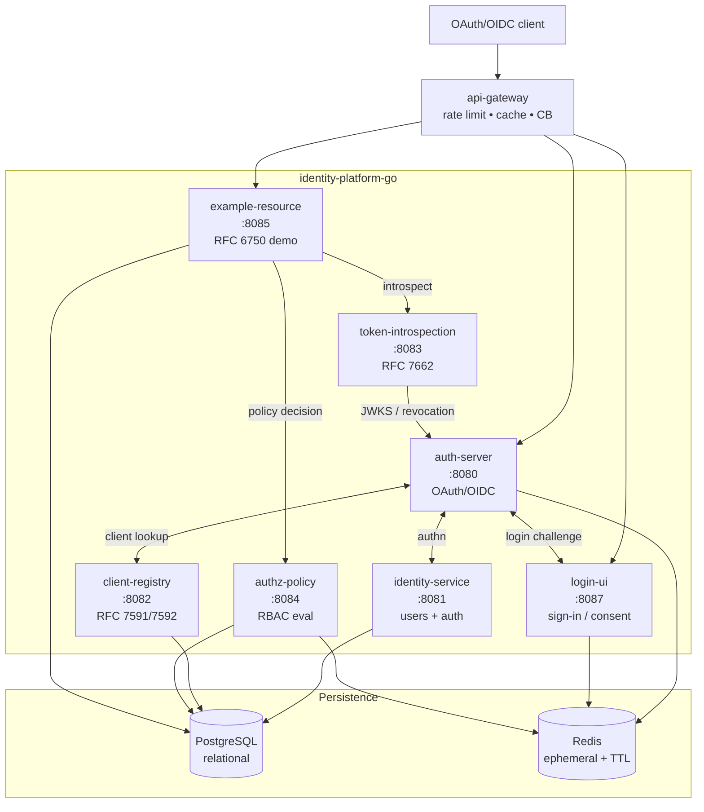
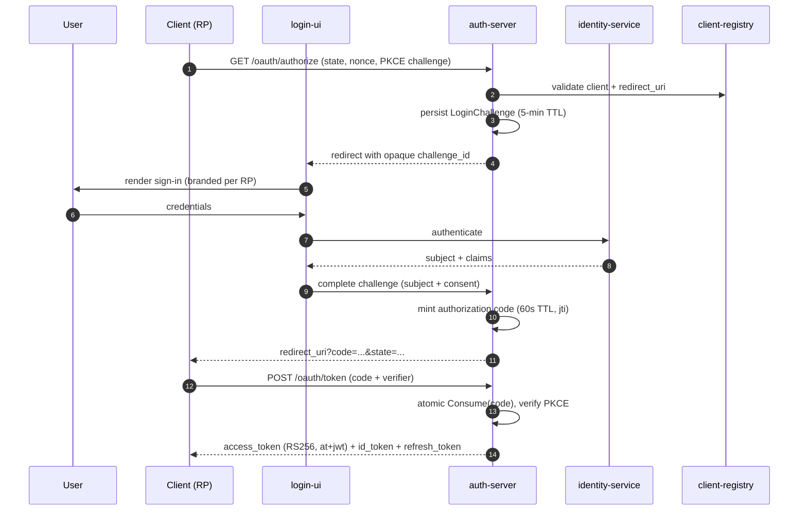

# identity-platform-go

A production-grade reference implementation of OAuth 2.1 / OpenID Connect in Go,
built as seven independently deployable services with clean hexagonal architecture
enforced at compile time.

- **Repo:** [`jedi-knights/identity-platform-go`](https://github.com/jedi-knights/identity-platform-go)
- **Language:** Go (workspace monorepo)
- **Deploy:** Fly.io (per-service `fly.<service>.toml`)
- **Shared library:** [`go-platform`](go-platform.md)

## What it is

A complete identity and access management platform that supports both
machine-to-machine (`client_credentials`) and human-interactive (`authorization_code`
+ PKCE + OIDC) flows. It demonstrates how to build a distributed OAuth/OIDC stack
with framework-agnostic business logic, dual-mode persistence (in-memory for local;
Postgres + Redis for production), and zero external dependencies for development.

## Service topology



### Services

| Service | Port | Responsibility |
|---|---|---|
| **auth-server** | 8080 | Authorization server — issues access, ID, and refresh tokens; revocation; introspection; JWKS |
| **identity-service** | 8081 | User registration; password verification (bcrypt); identity claims for `/userinfo` |
| **client-registry-service** | 8082 | OAuth client lifecycle, secret validation, scope enforcement, RFC 7591/7592 dynamic registration |
| **token-introspection-service** | 8083 | Standalone validator — offline JWT verify via JWKS + Redis revocation check |
| **authorization-policy-service** | 8084 | RBAC evaluator over `{subject, resource, action}` tuples |
| **example-resource-service** | 8085 | Demonstrates two-layer authz: scope validation + policy call |
| **login-ui** | 8087 | Sign-in, registration, email verification, consent, logout (multi-tenant, branded per RP) |

All inter-service communication is synchronous HTTP. No shared databases — each
service owns its data; service boundaries are enforced at the persistence layer.

## Architectural pattern

Ports and adapters (hexagonal) with strict, enforced dependency direction:

```
domain  →  application  →  ports  →  adapters
```

- **`domain/`** — pure business models and repository *interfaces*; no framework imports.
- **`application/`** — business logic (token issuance, PKCE validation, policy evaluation); depends only on domain interfaces.
- **`ports/`** — inbound (HTTP) and outbound (DB, sibling service) interfaces.
- **`adapters/`** — HTTP handlers, Postgres / Redis / in-memory repositories, inter-service HTTP clients.

Compile-time interface checks pinned at the declaration site catch drift early:

```go
var _ domain.ClientRepository = (*ClientRepository)(nil)
```

This is the ADR-0005 contract: every adapter declares the port it implements, so
swapping in-memory for Postgres at deploy time is mechanical, not exploratory.

### Patterns in use

- **Strategy** — pluggable OAuth grant types via `GrantStrategy` + `GrantStrategyRegistry` (ADR-0003).
- **Repository** — domain interfaces let adapters be swapped without touching application logic.
- **Specification** — composable, fine-grained policy rules.
- **Chain of Responsibility** — middleware pipeline (trace ID → recovery → logging → auth → handler).
- **Factory / Registry** — grant strategies; container-based DI (see [`go-platform`](go-platform.md)).

## Persistence model

Hybrid, environment-driven fallback. Every service can run with zero external
dependencies (in-memory) or with full persistence (Postgres + Redis), selected at
startup by env var.

| Data | Primary | Fallback | Toggle |
|---|---|---|---|
| Access / refresh tokens | Redis (TTL) | In-memory map | `AUTH_REDIS_URL` |
| Authorization codes | Redis (atomic GET+DEL) | In-memory map | `AUTH_REDIS_URL` |
| Revocation indices | Redis SET | In-memory set | `AUTH_REDIS_URL` |
| Users + credentials | Postgres | In-memory map | `DATABASE_URL` |
| OAuth clients | Postgres | In-memory map | `DATABASE_URL` |
| Authorization policies | Postgres | In-memory map | `DATABASE_URL` |
| SSO sessions | Redis | In-memory map | `LOGIN_UI_REDIS_URL` |
| Login challenges | Redis + memory | In-memory map | `AUTH_REDIS_URL` |

Postgres uses `pgx/v5` with embedded migrations via `golang-migrate`. Redis
stores ephemeral state with TTLs matching JWT expiry; atomic Lua scripts keep
replicas consistent.

## Authentication mechanisms

| Mechanism | Where | Standard |
|---|---|---|
| Bearer JWT (RS256) | Access tokens, ID tokens | RFC 6750, RFC 7519, RFC 9068, RFC 7518 |
| HTTP Basic | Confidential client auth at token endpoint | RFC 7617 |
| HTTP POST form | Confidential client auth at token endpoint | RFC 6749 §2.3.1 |
| PKCE-S256 | Authorization code flow (mandatory, public + confidential) | RFC 7636 |
| Password + bcrypt | User login via identity-service | de facto |
| Service bearer | Internal auth between login-ui ↔ auth-server | custom |

Detailed write-ups for each live under `docs/auth-mechanisms/` in the source repo.

## Authorization code + PKCE + OIDC flow



Replay defenses are layered:

- **Authorization code** — single-use, 60-second TTL, atomic `Consume`, `code_jti` claim on issued tokens (ADR-0009).
- **Refresh token family** — rotation marks tokens consumed (not deleted); reusing a consumed token revokes the entire family and cascades to all access tokens carrying that `family_id` (ADR-0014).

## OAuth / OIDC standards implemented

| RFC / Spec | What |
|---|---|
| RFC 6749 | OAuth 2.0 core (`client_credentials`, `authorization_code`, `refresh_token`) |
| RFC 6750 | Bearer token usage |
| RFC 7009 | Token revocation (idempotent) |
| RFC 7517 / 7518 | JWKS + JWA (RS256 primary, HS256 legacy) |
| RFC 7591 / 7592 | Dynamic client registration + management |
| RFC 7636 | PKCE (S256 only — `plain` rejected) |
| RFC 7662 | Token introspection (always 200 OK) |
| RFC 8414 | Authorization server metadata |
| RFC 9068 | JWT profile for access tokens (`typ: at+jwt`) |
| OIDC Core 1.0 | `authorization_code` response type, ID tokens, nonce, `at_hash` |
| OIDC Discovery 1.0 | `/.well-known/openid-configuration` |

Intentional omissions (documented in roadmap): RFC 7521/7523 (JWT bearer assertion
grants — now unblocked by RS256), RFC 8628 (device flow), RFC 9449 (DPoP), and OIDC
implicit/hybrid flows (deprecated by OAuth 2.1).

## ADR index

| # | Title | Decision |
|---|---|---|
| 0001 | Ports and adapters | Hexagonal architecture across all services |
| 0002 | Go workspaces | Multi-module monorepo via `go work`; per-module independent versioning |
| 0003 | Strategy for grant types | Pluggable `GrantStrategy` interface + registry |
| 0004 | In-memory persistence (reference) | Default to in-memory adapters; zero external deps for local |
| 0005 | Adapter scalability contract | Compile-time interface checks on every adapter |
| 0006 | Redis token storage | Tokens + revocation in Redis with TTL; fallback to in-memory |
| 0007 | Postgres relational data | `pgx/v5` + embedded migrations; one DB per service |
| 0008 | RS256 + JWKS | Asymmetric signing with rotation; `kid`-based key selection |
| 0009 | Authorization code + PKCE | Mandatory PKCE-S256, single-use codes, replay detection via `code_jti` |
| 0010 | OIDC Core 1.0 | ID tokens, nonce, `at_hash`, `/userinfo` |
| 0011 | Unified login-ui | Multi-tenant user-facing service; auth-server stays protocol-only |
| 0012 | Authorization server metadata | RFC 8414 + OIDC Discovery from running config |
| 0013 | Dynamic client registration | RFC 7591 self-service + RFC 7592 management |
| 0014 | Refresh token rotation | Family tracking, replay detection, cascade revoke |

Full ADRs live at `docs/adr/` in the source repo.

## Non-obvious design choices worth knowing

- **Login challenge opacity.** The full `/oauth/authorize` request is validated,
  persisted server-side with a 5-minute TTL, and handed to login-ui as a 32-byte
  opaque ID. This prevents URL-length exhaustion, log leakage of `state` / `nonce`,
  and allows mutation (login-ui sets `SessionID` after auth) without re-parsing
  the original query.
- **Dual replay defenses.** Access tokens may carry both `code_jti` (ADR-0009)
  and `family_id` (ADR-0014). The two are independent and both trigger idempotent
  revocation cascades.
- **`typ` header enforcement.** Access tokens carry `typ: at+jwt`; ID tokens carry
  `typ: JWT`. Parsers reject the wrong type to prevent token-confusion attacks
  (RFC 8725 §3.11).
- **Independent service versioning.** Conventional Commits drive per-module
  semantic-release. A change to `libs/errors` automatically propagates a patch
  release to every service that depends on it, even when those services have no
  new code of their own.
- **Fail-open authz cache.** The policy service caches decisions in Redis (60s TTL)
  keyed by `{subject}:{resource}:{action}`. Role mutations do not invalidate the
  cache by default — production deployments should call
  `DEL authz:{subject_id}:*` on role change.

## Comparison to a UUID-key gateway

The repo's `docs/sun-gateway-comparison.md` benchmarks this design against a
proprietary UUID-API-key model (Cassandra-backed, async provisioning). Highlights:

- **Synchronous provisioning** — one Postgres transaction, immediate consistency;
  no provisioning window where new keys return 401.
- **No tombstones** — Postgres `DELETE` + `INSERT` leaves no garbage; Cassandra
  tombstones degrade read perf under churn.
- **Self-validating tokens** — RS256 JWTs verify offline. UUID keys require a DB
  roundtrip on every request.
- **Immediate revocation** — Redis `DEL` propagates instantly; Cassandra has a
  replication-lag window.

What this platform does *not* yet have (and the gateway repo provides): rate
limiting, usage tracking pipelines, ESI aggregation, circuit breakers.
