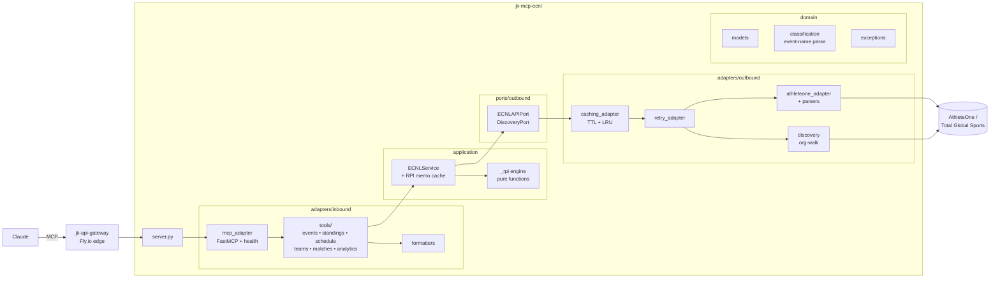

# jk-mcp-ecnl

An MCP server that exposes live ECNL (Elite Clubs National League) and ECRL
(ECNL Regional League) youth soccer data to AI assistants. Read-only, stateless,
deployed to Fly.io behind the jk-api-gateway.

- **Repo:** [`jedi-knights/jk-mcp-ecnl`](https://github.com/jedi-knights/jk-mcp-ecnl)
- **Language:** Python 3.13 (`uv` + FastMCP)
- **Deploy:** Fly.io — `https://jk-api-gateway.fly.dev/mcp/ecnl`
- **Sibling:** [`jk-mcp-nwsl`](jk-mcp-nwsl.md) (same template, different data)

## Why it exists

Youth soccer (ECNL / ECRL) is a sprawling system: leagues × genders × age groups
× conferences × seasons. Coaches, parents, and administrators need answers about
schedules, standings, RPI, and brackets — but no public, queryable API was
documented. This server bridges Claude to the **AthleteOne / Total Global
Sports** backend that powers `theecnl.com`, plus a built-in NCAA-standard RPI
engine.

## Architecture



Same hexagonal layout as `jk-mcp-nwsl`: strict inward dependency, pure domain,
composed adapters. The RPI engine is pure and tested in isolation; the service
layer memoizes RPI tables per `(event, flight, tie_weight)` so `get_rpi` and
`get_team_rpi` share a single computation.

## Tool surface (12 tools)

### Discovery + navigation
- `find_events` — resolve a human description (league, gender, season) to a
  numeric `eventID`. The natural entry point.
- `get_event_overview` — list divisions and flights for an event with team counts
  and tier designation.

### Schedule + results
- `get_schedule` — all matches in a flight (dates, venues, teams, scores)
- `get_team_schedule` — one team's match history within an event
- `get_match` — single match detail / box score
- `get_brackets` — playoff bracket structure if one exists

### Standings + composition
- `get_standings` — flight table (W-L-D, points, PPG)
- `get_teams` — teams in a flight
- `get_clubs` — clubs participating in an event

### Analytics
- `get_results` — completed match results (raw input for RPI)
- `get_rpi` — NCAA-standard RPI for every team in a flight
  `RPI = 0.25·WP + 0.50·OWP + 0.25·OOWP`
- `get_team_rpi` — one team's RPI with component breakdown

All tools are read-only and idempotent (`_READ_ANNOTATIONS`).

## Data source: AthleteOne / Total Global Sports

Documented in **ADR-0001**. The site `theecnl.com` is powered by an
unauthenticated REST API at `https://api.athleteone.com/api/`. The contract is
undocumented — reverse-engineered from the public site's JavaScript bundle — and
could change if the league restructures.

### Data hierarchy

```
league (ECNL / ECRL)
  └─ gender (boys / girls)
      └─ conference
          └─ season  =  one event (numeric eventID)
              └─ divisions (age groups, e.g., G2008/2007 ≈ "U17")
                  └─ flights (competition tiers)
                      ├─ standings  (by flightID)
                      └─ schedule   (by flightID)
```

Event names encode metadata as plain strings — e.g., `ECNL Girls Southeast
2025-26`, `ECNL RL Girls STXCL 2025-26` — parsed deterministically by
`domain/classification.py`.

### Event discovery

There is no "list all events" endpoint. The discovery adapter walks four seed
organization IDs (orgID `9`, `12`, `13`, `16` — ECNL girls/boys + ECRL
girls/boys) via `get-org-club-list-by-orgID`, collects every event ID surfaced
through each club's record, and classifies them by name. Stable, clever, and
documented.

### RPI engine

Models NCAA D1 women's soccer convention:

```
WP   = (W + tie_weight·T) / (W + L + T)         (tie_weight default 1/3, configurable to 0.5)
OWP  = mean WP of opponents, excluding rated team
OOWP = mean OWP of opponents, excluding rated team
RPI  = 0.25·WP + 0.50·OWP + 0.25·OOWP
```

Within a single flight (typically a round-robin), OWP and OOWP converge to ~0.5,
so RPI ≈ WP — discriminating power emerges only across pools. Cross-conference /
national pools are deferred to a future enhancement noted in the ADR.

## Deployment

`fly.toml`:

- Region `iad` (US East)
- HTTP service on port 8000, mounted at `/mcp/ecnl` behind the api-gateway
- Health endpoints: `/health`, `/livez`, `/readyz` (30-second interval)
- Private service (no public IP) — reached via Flycast over Fly's internal
  network; gateway terminates TLS at the edge
- `min_machines = 0` — scale-to-zero; auto-start on request

## ADRs

| # | Title | Decision |
|---|---|---|
| 0001 | Data source: AthleteOne / Total Global Sports public API | Use reverse-engineered AthleteOne endpoints (no auth); seed event discovery via the four `orgID` walks; document the wire envelope and event-name grammar; defer cross-conference RPI pools to v2. |

## Quality gates

- Coverage 92.5% (higher than NWSL's 91%)
- Cyclomatic complexity ≤ 7
- pytest + pytest-asyncio + pytest-bdd
- Conventional Commits → semantic-release → Fly deploy

## What differs from `jk-mcp-nwsl`

Both servers share the same template (Python 3.13 + FastMCP + httpx + hexagonal
architecture + Fly.io). The distinctions:

| Aspect | jk-mcp-ecnl | jk-mcp-nwsl |
|---|---|---|
| Domain | Youth soccer (age groups, conferences, clubs) | Pro women's soccer |
| Data source | AthleteOne (one upstream) | ESPN + SDP/Opta + NWSL CMS (three upstreams) |
| Tools | 12 | 16 |
| Discovery | Org-walk seed needed (no list-events endpoint) | Direct team/season queries |
| Analytics | NCAA RPI engine (WP / OWP / OOWP) | Strength of schedule + adjusted PPG (RPI-flavored) |
| Bracket support | Yes (flight playoffs) | Challenge Cup standings instead |
| Edge | Behind jk-api-gateway at `/mcp/ecnl` | Direct Fly subdomain `jk-mcp-nwsl.fly.dev` |

## Tool authorization roadmap

Same posture and same plan as [`jk-mcp-nwsl`](jk-mcp-nwsl.md#tool-authorization-roadmap):
tools are open today; the [agentic posture roadmap](agentic-posture.md) adds a
bearer-token requirement on the Streamable HTTP transport, an authorization
port that consults `authorization-policy-service`, extended tool annotations
(`sensitivity`, `cost_class`, `rate_limit_class`), and structured audit events
per the planned `go-platform/audit` schema.

## Non-obvious details

- **Event names *are* the schema.** Classification (league / gender / conference
  / season) lives in event-name regex parsing. A league-side rename would break
  discovery — mitigated by orgID stability.
- **RPI memo cache.** The service layer caches RPI tables per `(event, flight,
  tie_weight)` triple so `get_rpi` and `get_team_rpi` don't recompute when both
  are called in the same session. Hidden in the constructor, not in docstrings.
- **No cross-conference pools (yet).** Within a single conference, OWP/OOWP
  collapse to ~0.5, so RPI ≈ WP. Cross-conference pools — where RPI gets its
  discriminating power — are explicitly deferred.
- **Match detail returned raw.** Instead of normalizing the highly variable
  match-detail JSON shapes, the adapter pretty-prints the upstream payload and
  hands it to the formatter. Pragmatic for v1; normalization deferred.
- **Discovery is the surprising part.** The lack of a "list events" endpoint
  forced an org-walk solution. ADR-0001 documents both the discovery contract
  and the four seed IDs, so future readers don't have to re-derive them.
