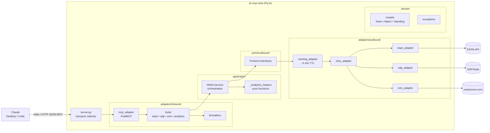

# jk-mcp-nwsl

An MCP server that bridges Claude (and other AI assistants) to live National
Women's Soccer League data. Read-only, stateless, free, and deployed to Fly.io.

- **Repo:** [`jedi-knights/jk-mcp-nwsl`](https://github.com/jedi-knights/jk-mcp-nwsl)
- **Language:** Python 3.13 (`uv` + FastMCP)
- **Deploy:** Fly.io — `https://jk-mcp-nwsl.fly.dev/mcp`
- **Transports:** stdio (default) and Streamable HTTP

## Why it exists

LLM knowledge has a cutoff date — the model can't answer questions about current
NWSL standings, this weekend's match, or the latest roster move. This connector
solves that with 16 read-only tools backed by three public upstream sources:

- **ESPN public API** — teams, scores, standings, schedules, news
- **SDP / Opta feed** — the unofficial backend behind nwslsoccer.com; player
  stats, team aggregates, historical standings back to 2016
- **NWSL CMS** — award articles (Best XI, Player of the Month, etc.)

No accounts, no API keys, no auth on the client side. Users add it through Claude
Desktop / Claude Code and ask questions in natural language.

## Architecture

Dependency direction is strictly inward: `adapters → ports → application →
domain`. The domain layer is pure data; the service orchestrates through ports
without knowing about HTTP, MCP, or JSON. Adapters are composed (caching wraps
retry, retry wraps the HTTP client) rather than middleware-chained.

## Tool surface (16 tools)

### ESPN — core league data
- `get_teams` — full team listing
- `get_team` — one team's record + metadata
- `get_scoreboard` — matches for a given date window
- `get_standings` — league table
- `get_team_schedule` — one team's match history
- `get_match_details` — single match box score
- `get_news` — headlines

### SDP / Opta — historical + advanced
- `get_player_leaderboards` — top scorers, assists, etc.
- `get_team_season_stats` — aggregate metrics
- `get_historical_standings` — back to 2016
- `get_challenge_cup_standings` — back to 2020
- `get_roster` — current roster

### Derived analytics — pure functions, no extra HTTP
- `get_strength_of_schedule`
- `get_results_by_opponent_tier`
- `get_adjusted_points_per_game` — applies RPI-style opponent-quality
  weighting to current PPG (simplified for a 16-team pro league)

### CMS
- `get_award_articles` — Best XI, Player of the Month, etc.

All tools are annotated `readOnlyHint = true` — a submission gate for the
Anthropic Software Directory.

## Transport

Two MCP transports, toggled via `MCP_TRANSPORT`:

- **`stdio`** (default) — Claude spawns the server as a subprocess; JSON-RPC
  flows over stdin/stdout. The server uses a custom JSON log formatter writing
  to stderr so log lines never corrupt the protocol stream.
- **`streamable-http`** — HTTP on port 8000. Used by the hosted Fly.io instance.
  DNS-rebinding and Origin-header validation are configured via
  `MCP_ALLOWED_HOSTS` and `MCP_ALLOWED_ORIGINS`, defaulting to `https://claude.ai`
  and `https://claude.com`.

## Deployment

Fly.io (ADR-0001). The Dockerfile is a Python 3.13-slim multi-stage build with
`uv` baked in; the dependency layer is separated from source so code changes
don't re-download packages. Deploys are automatic on every semantic-release tag
via a GitHub Action calling `flyctl deploy --remote-only` (the image builds on
Fly's infrastructure — no Docker-in-Docker).

## ADRs

| # | Title | Decision |
|---|---|---|
| 0001 | Deploy MCP server to Fly.io | Container-native PaaS, per-second billing, free tier, direct `Dockerfile` deploy — beat Railway, ECS, and self-hosted for a lightweight stateless server. |

## Quality gates

- Cyclomatic complexity ≤ 7 (`py-cyclo`)
- Test coverage ≥ 90% (currently 91%)
- `ruff` lint + format
- Pytest with `pytest-asyncio` and `pytest-bdd` for BDD acceptance tests
- Conventional Commits enforced for semantic-release

## Privacy posture

The server collects no personal data, has no accounts, and stores nothing past
the in-process response cache (~5-minute TTL, gone on restart). Fly.io logs
record tool name + status + error message — no request bodies. All three upstream
sources are public; the server forwards tool arguments without enrichment. No
cookies, no analytics, no telemetry. Documented in `PRIVACY.md` for Anthropic
Software Directory compliance.

## Non-obvious details

- **Adapter composition over middleware.** Cross-cutting concerns are layered as
  wrapping adapters: `SDPRetryingAdapter(SDPCachingAdapter(SDPAdapter))`. Each
  layer implements the same port interface; behavior is added by composition.
- **Derived analytics are pure.** The three analytics tools make no upstream
  calls — they consume `get_standings` + `get_team_schedule` output and compute
  in-process. This keeps the dependency on ESPN's contract narrow.
- **Fragile upstream contract.** The SDP/Opta feed and NWSL CMS are
  reverse-engineered. Upstream format changes will silently break tools; there
  is no schema versioning or upstream health check beyond
  retry-on-transient-error. Acknowledged in code comments and the README.
- **No database.** Stateless and ephemeral. The cache lives in process memory;
  no Redis, no SQLite. Fly.io's free tier doesn't offer managed databases, and
  the server doesn't need one.
- **Federation, not proxying.** Most MCP connectors wrap a single data source.
  This one composes three independent upstreams with pure-function analytics on
  top — closer to a federation layer than a proxy.
