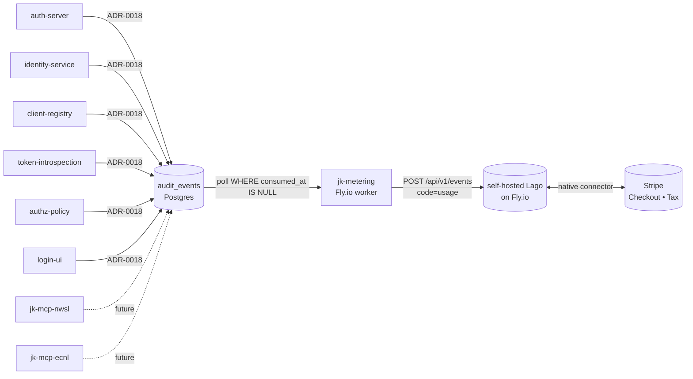

# jk-metering

The Phase B metering shim. A small Go worker that consumes the
`audit_events` table written by
[`go-platform/audit/durable`](go-platform.md), transforms each event to
a Lago event, and posts to Lago's Event API. The last hop in the
billing pipeline before invoices materialise in Stripe.

- **Repo:** [`jedi-knights/jk-metering`](https://github.com/jedi-knights/jk-metering)
- **Language:** Go
- **Deploy:** Fly.io (worker, no public HTTP)
- **Source:** Postgres `audit_events` table
- **Sink:** self-hosted Lago Event API → Stripe via Lago's native connector

## Why it exists

[`agentic-posture.md`](agentic-posture.md#usage-accounting) sets the
Phase B prerequisite: every paid surface in the portfolio emits ADR-0018
audit events; metering and billing readiness must precede any further
agentic capability work. ADR-0019 in identity-platform-go specifies the
plumbing — durable audit sink → metering shim → Lago → Stripe — and
this service is the **shim** in that chain. End-to-end exactly-once is
delivered by two dedupes working in tandem.

## Pipeline position



The shim has **no public surface** — it is a worker that polls Postgres
and posts to Lago. The audit pipeline is the contract; the shim is one
implementation of it.

## Architecture

Strict hexagonal, mirroring the rest of the portfolio.

```
cmd/main.go              composition root + signal handling
internal/
├── config/              viper-based env config (METERING_*)
├── domain/              AuditEvent + LagoEvent value types
├── ports/               EventSource + MeterSink interfaces
├── application/
│   ├── transformer      pure audit→Lago property pump
│   └── service          poll → transform → push → mark loop
└── adapters/outbound/
    ├── postgres/        EventSource backed by audit_events
    └── lago/            MeterSink posting to Lago Event API
```

| Layer | Responsibility |
|---|---|
| **`domain`** | `AuditEvent` mirrors `go-platform/audit.Event`; `LagoEvent` + `LagoEventWrapper` match Lago's `POST /api/v1/events` request shape. |
| **`ports.EventSource`** | `FetchUnconsumed(ctx, limit)` + `MarkConsumed(ctx, eventID)`. |
| **`ports.MeterSink`** | `PushEvent(ctx, event)`. |
| **`application.Transform`** | Pure function. Audit envelope flattens into Lago `properties`; `attrs` map merges verbatim with attrs winning collisions. |
| **`application.MeteringService`** | Tick loop. Per-event failures log + count but stay on the queue; whole-batch failures surface to the caller. |
| **`adapters/outbound/postgres`** | pgx-backed source. Identifier-validated table name interpolation; nilable `consumed_at` round-trip via custom scanner. |
| **`adapters/outbound/lago`** | Bearer-token POST with envelope wrapper. Non-2xx surfaces as `*APIError`. |

## SKU model — catalog-as-data

Per ADR-0019, the shim emits **one Lago event code (`usage`)** per
audit event. Every envelope field becomes a Lago event `property`, and
the `attrs` map is unpacked verbatim. **All SKU discrimination happens
via Lago billable-metric filters** on properties like `event_type`,
`resource_kind`, `resource_parent`, `resource_path`, `actor_type`.

Adding a new billable surface — a new MCP tool, a new endpoint, a new
web-app feature — requires **zero metering-shim changes**. Operators
define filters in Lago admin; the catalog is data, not code.

## Idempotency contract

Two complementary dedupes give exactly-once at-rest from emission
through billing.

| Layer | Mechanism | Effect |
|---|---|---|
| Postgres source | `consumed_at` set after successful Lago push | A row marked consumed is never re-fetched. |
| Lago sink | `transaction_id = audit event_id` (ULID) | Lago dedupes on this; retries do not double-bill. |

The single edge case is a process crash *between* the Lago 2xx response
and the `UPDATE audit_events SET consumed_at = now()`. On restart the
shim re-fetches that row, sends the same `transaction_id` to Lago, Lago
recognises the dedup and returns a no-op success, and the shim marks
consumed. No duplicate, no gap.

## Billing identity

The Lago `external_subscription_id` (which customer the event bills
against) is configurable per service via
`METERING_METERING_BILLING_IDENTITY`:

| Value | Behaviour | When to use |
|---|---|---|
| `subject` (default) | `event.subject_id`, falling back to `client_id` then `actor_id` | "User owns the cost" — ADR-0019 default |
| `actor` | `event.actor_id`, falling back to subject then client | Bill the agent operator (Claude integrators, etc.) |
| `client` | `event.client_id`, falling back to subject then actor | Bill the OAuth client / tenant |

An event with every candidate empty is marked consumed and counted as
skipped — the shim does not retry-storm unattributable records.

## Configuration

All variables under `METERING_`.

| Variable | Required | Default | Purpose |
|---|---|---|---|
| `METERING_AUDIT_DSN` | yes | — | Postgres DSN for the `audit_events` table |
| `METERING_AUDIT_TABLE` | no | `audit_events` | Override the audit table name |
| `METERING_LAGO_BASE_URL` | yes | — | Lago API root (`http://lago-api.internal`) |
| `METERING_LAGO_API_KEY` | yes | — | Lago API key (never logged) |
| `METERING_METERING_POLL_INTERVAL_SECONDS` | no | `5` | Polling interval |
| `METERING_METERING_BATCH_SIZE` | no | `100` | Max events per tick |
| `METERING_METERING_BILLING_IDENTITY` | no | `subject` | `subject` / `actor` / `client` |
| `METERING_LOG_LEVEL` | no | `info` | `debug` / `info` / `warn` / `error` |
| `METERING_LOG_FORMAT` | no | `json` | `json` / `text` |

## Deployment

Fly.io worker. The repo includes a `Dockerfile` (multi-stage distroless)
and a `fly.toml` configured for one always-on `shared-cpu-1x` worker
with no public listener.

```bash
fly secrets set \
  METERING_AUDIT_DSN=... \
  METERING_LAGO_BASE_URL=... \
  METERING_LAGO_API_KEY=...
fly deploy --remote-only
```

## What's deliberately deferred

| Deferral | Why |
|---|---|
| `LISTEN/NOTIFY` for sub-second latency | 5s polling default is fine until billing latency matters more than implementation simplicity. |
| Bulk ingestion (Lago batch API) | One event per call is simpler; batch lands when workload pressure justifies it. |
| Retry / circuit breaker | Per-event failures stay on the queue (no `consumed_at`); next tick retries. Backoff + DLQ wait for production calibration. |
| Customer / subscription provisioning | The shim assumes the Lago customer exists when an event arrives. Provisioning happens up front via the `login-ui` plan-selection flow (separate work). |

## Reference

- [identity-platform-go ADR-0019](https://github.com/jedi-knights/identity-platform-go/blob/main/docs/adr/0019-usage-accounting-and-billing.md)
  — full design, flexibility-commitment table, and SKU recipes.
- [`go-platform/audit/durable`](go-platform.md) — the source side of the
  pipeline.
- [`billing-and-metering-setup.md`](billing-and-metering-setup.md) —
  end-to-end setup checklist (Lago + Stripe + this shim).
- [`agentic-posture.md`](agentic-posture.md#usage-accounting) — where
  this service fits in the portfolio's overall agentic posture.
