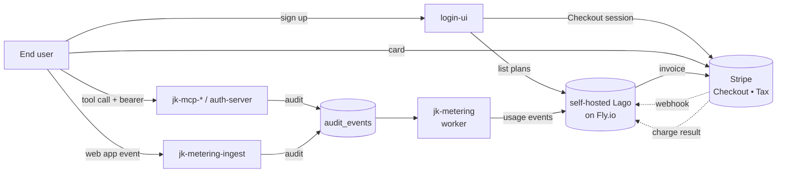

# Operator runbook — billing + metering deployment

Concrete steps to bring the Phase B billing pipeline live: deploy
self-hosted Lago, connect Stripe, deploy the two metering services,
configure login-ui, define the first SKUs, and run an end-to-end smoke
test. Run the steps top-to-bottom on a fresh environment; resume from
the matching section when re-running parts.

> All the code is merged. This runbook is the missing operator-side work
> — accounts, secrets, deployments, and Lago configuration.

- **Design context:** [`agentic-posture.md`](agentic-posture.md#usage-accounting),
  [identity-platform-go ADR-0019](https://github.com/jedi-knights/identity-platform-go/blob/main/docs/adr/0019-usage-accounting-and-billing.md)
- **Design-time sequence:** [`billing-and-metering-setup.md`](billing-and-metering-setup.md)
- **Per-project pages:** [`jk-metering`](jk-metering.md)

## Pipeline once everything is live



## 0. Prerequisites

- Fly.io org with billing enabled
- Stripe account (start in test mode; flip to live last)
- `flyctl` and `gh` CLIs authenticated
- `psql` for one Lago admin task that doesn't fit in `fly ssh`
- Domain on the gateway (e.g. `auth.jediknights.dev`) — referenced by
  the JWKS URL and the Stripe success/cancel URLs

Decide once, write down:

| Decision | Recommended default | Why |
|---|---|---|
| Lago region | `iad` | Matches existing identity services |
| Stripe mode | test until end-to-end smoke passes | Test invoices stay separate from real |
| Billing identity | `subject` | "User owns the cost" per ADR-0019 |
| Polling interval | 5 s | Worker default; tighten when billing latency matters |
| Currency | USD | Switch in step 5 if different |

## 1. Stripe setup

Test mode unless noted.

```bash
# Toggle test mode at https://dashboard.stripe.com (top-right)
```

1. **Enable products** in the Stripe dashboard:
   - **Stripe Checkout** (Settings → Payments → Checkout) — default config is fine
   - **Customer Portal** (Settings → Billing → Customer portal) — allow:
     card update ✅, invoice history ✅, subscription cancellation per
     business rules
   - **Stripe Tax** (Settings → Tax) — register origin address, set
     automatic tax to ON

2. **Create a restricted API key** at Developers → API keys:
   - **Permissions:** Customers (write), PaymentMethods (write),
     PaymentIntents (write), Invoices (write), Subscriptions (write),
     Webhooks (read).
   - Save the secret as `STRIPE_API_KEY_TEST` in your password manager.

3. **Configure a webhook endpoint pointing at Lago** (you'll set the
   exact URL after Lago deploys in step 2; come back to this then):
   - Endpoint URL: `https://api.billing.<your-domain>/webhooks/stripe`
   - Events: `checkout.session.completed`,
     `invoice.payment_succeeded`, `invoice.payment_failed`,
     `customer.subscription.updated`,
     `customer.subscription.deleted`
   - Save the webhook signing secret as `STRIPE_WEBHOOK_SECRET_TEST`.

## 2. Deploy self-hosted Lago to Fly.io

Lago ships three Docker images. Three Fly apps total, one Postgres and
one Redis backing them.

### 2.1 Provision backing services

```bash
# Postgres for Lago (separate cluster from identity-platform's)
fly postgres create --name lago-pg --region iad --vm-size shared-cpu-1x --volume-size 10

# Redis for Lago (Upstash via Fly)
fly redis create --name lago-redis --region iad
```

Capture the connection strings — `lago-pg` outputs a `DATABASE_URL`,
`lago-redis` outputs a `REDIS_URL`.

### 2.2 Generate encryption keys

Lago needs three encryption secrets and an RSA signing key.

```bash
LAGO_RSA_PRIVATE_KEY="$(openssl genrsa 2048 | openssl base64 -A)"
ENCRYPTION_PRIMARY_KEY="$(openssl rand -hex 32)"
ENCRYPTION_DETERMINISTIC_KEY="$(openssl rand -hex 32)"
ENCRYPTION_KEY_DERIVATION_SALT="$(openssl rand -hex 32)"
SECRET_KEY_BASE="$(openssl rand -hex 64)"
```

Save all five plus `STRIPE_API_KEY_TEST` to a vault — these never
rotate casually, and a fresh key invalidates every issued JWT.

### 2.3 Deploy lago-api

```bash
fly apps create lago-api --org <your-org>
fly secrets -a lago-api set \
  DATABASE_URL="$DATABASE_URL" \
  REDIS_URL="$REDIS_URL" \
  LAGO_RSA_PRIVATE_KEY="$LAGO_RSA_PRIVATE_KEY" \
  ENCRYPTION_PRIMARY_KEY="$ENCRYPTION_PRIMARY_KEY" \
  ENCRYPTION_DETERMINISTIC_KEY="$ENCRYPTION_DETERMINISTIC_KEY" \
  ENCRYPTION_KEY_DERIVATION_SALT="$ENCRYPTION_KEY_DERIVATION_SALT" \
  SECRET_KEY_BASE="$SECRET_KEY_BASE" \
  LAGO_FROM_EMAIL="billing@jediknights.dev" \
  LAGO_API_URL="https://api.billing.jediknights.dev" \
  LAGO_FRONT_URL="https://billing.jediknights.dev"

# Minimal fly.toml — adjust the image tag to a pinned release.
cat > /tmp/lago-api.fly.toml <<'TOML'
app = "lago-api"
primary_region = "iad"
[build]
  image = "getlago/api:v1"
[http_service]
  internal_port = 3000
  force_https = true
  auto_stop_machines = false
  auto_start_machines = true
  min_machines_running = 1
[[vm]]
  cpu_kind = "shared"
  cpus = 1
  memory = "1gb"
TOML
fly deploy -a lago-api -c /tmp/lago-api.fly.toml --remote-only

# Run Lago's DB migration once.
fly ssh console -a lago-api -C "rails db:migrate"
```

### 2.4 Deploy lago-worker (background jobs)

Same image, different entrypoint:

```bash
fly apps create lago-worker --org <your-org>
fly secrets -a lago-worker import < <(fly secrets -a lago-api list -j | jq -r '.[].Name' | xargs -I{} echo {}=$(fly secrets -a lago-api show {} -j 2>/dev/null))
# Simpler: replicate the same secrets you set on lago-api.

cat > /tmp/lago-worker.fly.toml <<'TOML'
app = "lago-worker"
primary_region = "iad"
[build]
  image = "getlago/api:v1"
[processes]
  app = "./scripts/start.worker.sh"
[[vm]]
  cpu_kind = "shared"
  cpus = 1
  memory = "512mb"
TOML
fly deploy -a lago-worker -c /tmp/lago-worker.fly.toml --remote-only
```

### 2.5 Deploy lago-front (admin UI)

```bash
fly apps create lago-front --org <your-org>
fly secrets -a lago-front set \
  API_URL="https://api.billing.jediknights.dev" \
  APP_ENV="production"

cat > /tmp/lago-front.fly.toml <<'TOML'
app = "lago-front"
primary_region = "iad"
[build]
  image = "getlago/front:v1"
[http_service]
  internal_port = 80
  force_https = true
[[vm]]
  cpu_kind = "shared"
  cpus = 1
  memory = "256mb"
TOML
fly deploy -a lago-front -c /tmp/lago-front.fly.toml --remote-only
```

### 2.6 First-run smoke

```bash
curl -fsS https://api.billing.jediknights.dev/health
# {"status":"ok"}
```

Open `https://billing.jediknights.dev`, create an admin user, log in.

### 2.7 Mint a Lago API key

Lago admin → Settings → API keys → Create. Save as `LAGO_API_KEY` in
the vault — every downstream service needs it.

## 3. Connect Stripe to Lago

In Lago admin:

1. **Settings → Integrations → Add Stripe.**
2. Paste `STRIPE_API_KEY_TEST` and the webhook signing secret from
   step 1.3.
3. Click Test connection.
4. Go back to the Stripe dashboard webhook from step 1.3; the URL is
   now `https://api.billing.jediknights.dev/webhooks/stripe`. Confirm
   the endpoint shows recent successful pings.

## 4. Deploy the metering services

Both binaries live in [`jedi-knights/jk-metering`](https://github.com/jedi-knights/jk-metering)
and share one Dockerfile. The worker has no public listener; the
ingest service runs HTTP behind the gateway.

### 4.1 Worker — `jk-metering`

```bash
cd /path/to/jk-metering
fly apps create jk-metering --org <your-org>
fly secrets -a jk-metering set \
  METERING_AUDIT_DSN="<identity audit_events DSN>" \
  METERING_LAGO_BASE_URL="https://api.billing.jediknights.dev" \
  METERING_LAGO_API_KEY="$LAGO_API_KEY"
fly deploy -a jk-metering --remote-only -c fly.toml
```

The `audit_events` table is whatever Postgres the identity services
write to via `go-platform/audit/durable`. It can be the
identity-platform-go DB or its own dedicated Postgres.

### 4.2 Ingest — `jk-metering-ingest`

```bash
fly apps create jk-metering-ingest --org <your-org>
fly secrets -a jk-metering-ingest set \
  METERING_AUDIT_DSN="<identity audit_events DSN>" \
  METERING_INGEST_JWKS_URL="https://auth.jediknights.dev/.well-known/jwks.json" \
  METERING_INGEST_EXPECTED_ISSUER="https://auth.jediknights.dev"
fly deploy -a jk-metering-ingest --remote-only -c fly.ingest.toml
```

Route `https://auth.jediknights.dev/metering/events` →
`jk-metering-ingest:8090` on the `jk-api-gateway`.

## 5. Wire login-ui to Lago

```bash
fly secrets -a login-ui set \
  LOGIN_UI_BILLING_LAGO_URL="https://api.billing.jediknights.dev" \
  LOGIN_UI_BILLING_LAGO_API_KEY="$LAGO_API_KEY" \
  LOGIN_UI_BILLING_SUCCESS_URL="https://auth.jediknights.dev/billing/portal?subject={CHECKOUT_SESSION_SUBJECT}" \
  LOGIN_UI_BILLING_CANCEL_URL="https://auth.jediknights.dev/billing/plans?subject={CHECKOUT_SESSION_SUBJECT}"
fly deploy -a login-ui --remote-only
```

Replace `{CHECKOUT_SESSION_SUBJECT}` with whatever Lago substitutes for
the customer's external ID in URLs — check the Lago docs for the exact
placeholder syntax.

## 6. First SKUs in Lago

Set up enough Lago configuration to bill one full SKU shape per
category, so the smoke test exercises every audit event_type the
portfolio currently emits.

### 6.1 Billable metrics

In Lago admin → Billable metrics → Create one per row:

| Code | Aggregation | Filter |
|---|---|---|
| `mcp_tool_call` | count | `event_type = tool_invoked` |
| `nwsl_server_use` | count | `resource_parent = jk-mcp-nwsl` |
| `auth_token_issuance` | count | `resource_kind = token` AND `action = issue` |
| `webapp_feature_use` | count | `resource_kind = feature` |

Each metric reads against the single `usage` event code that
`jk-metering` emits — Lago discriminates entirely via filters.

### 6.2 Plans

In Lago admin → Plans → Create three plans:

- **Free** ($0/mo). Add every billable metric from 6.1 with a generous
  free quota and no overage.
- **Starter (PAYG)** ($0/mo). Add billable metrics with `standard`
  per-unit pricing, no minimums.
- **Pro** (e.g. $19/mo). Flat fee + generous included quotas + overage
  at Starter pricing.

## 7. End-to-end smoke

The acceptance scenario for Phase B. Run it as a new user in test mode.

```bash
# 1. Sign up via login-ui (creates a user in identity-service).
open https://auth.jediknights.dev/sign-up

# 2. Sign in (the identity-service emits user_authenticated).
# 3. Land on /billing/plans?subject=<user-id>.
# 4. Pick Starter → POST /billing/checkout → redirect to Stripe Checkout.
# 5. Pay with Stripe test card 4242 4242 4242 4242, any future date, any CVC.
# 6. Stripe webhook → Lago → subscription provisioned.

# 7. Obtain an access token (client-credentials for a test agent
#    registered in client-registry-service with actor_type=agent).
curl -sX POST https://auth.jediknights.dev/oauth/token \
  -d grant_type=client_credentials -d client_id=<id> -d client_secret=<secret>

# 8. Call an MCP tool with the bearer token.
# 9. Verify the audit_events row.
psql "$AUDIT_DSN" -c "SELECT event_id, event_type, actor_type, resource_path
                       FROM audit_events ORDER BY created_at DESC LIMIT 5"

# 10. Within METERING_METERING_POLL_INTERVAL_SECONDS (5s default), the
#     row's consumed_at goes non-null. Confirm a matching event in Lago:
open https://billing.jediknights.dev  # Events → filter by subject
```

Then advance Lago's clock (admin → Subscriptions → … → Issue invoice
now in test mode) and confirm Stripe shows a charge against the test
card.

## 8. Flip to live mode

After the test-mode smoke passes:

1. Generate a **live** Stripe restricted API key + webhook signing
   secret.
2. `fly secrets -a lago-api set STRIPE_API_KEY=$STRIPE_API_KEY_LIVE
   STRIPE_WEBHOOK_SECRET=$STRIPE_WEBHOOK_SECRET_LIVE` and redeploy.
3. Update the Lago Stripe integration to use the live key.
4. Stripe will require activation (business details, bank account) —
   complete that in the Stripe dashboard.

## 9. Operations

### Monitoring

- **`jk-metering` worker.** Watch the `Skipped` and `Failed` counters
  exposed on the `Stats()` snapshot; emit them as Prometheus / OTel
  metrics in the follow-up that adds OTel.
- **`audit_events` table size.** A consumed row stays in the table —
  add a periodic prune in a future iteration, or set up Postgres
  partition-by-week now.
- **Lago dashboards.** Lago admin → Analytics shows invoiced amount,
  active subscriptions, MRR.
- **Stripe radar.** Card-decline patterns surface here, not in Lago.

### Key rotation

- **Lago API key.** Mint a new key in Lago admin, set it on every
  consumer (`jk-metering`, `jk-metering-ingest` (if it ever calls
  Lago — today it does not), `login-ui`), then revoke the old one in
  Lago admin.
- **Stripe API key.** Generate the new restricted key, update on Lago
  (`fly secrets -a lago-api set`), redeploy `lago-api`, revoke the
  old key.
- **Stripe webhook secret.** Roll the new one into Lago via the same
  Settings → Integrations form; old webhook calls fail-fast.

### Scaling

- **`jk-metering` worker.** One process is enough through several
  hundred events/second on a `shared-cpu-1x`. When lag grows past a
  full polling interval, add machines and Postgres will round-robin
  via `SKIP LOCKED` on the partial index (`audit_events_unconsumed`).
- **`jk-metering-ingest`.** Stateless; scale on request rate. Behind
  the gateway, the rate limit is the natural ceiling.
- **Lago.** `lago-api` scales horizontally; `lago-worker` is
  per-process — add more instances when the Sidekiq queue grows.

## 10. Troubleshooting

| Symptom | Likely cause | First check |
|---|---|---|
| `jk-metering` logs "no billing identity" | Event missing `subject_id`, `client_id`, and `actor_id` | Inspect the row — emitter bug |
| Lago events never arrive | Worker can't reach Lago | `fly logs -a jk-metering` for `POST /api/v1/events` errors |
| Lago events arrive but stay "pending" | Lago worker is down | `fly status -a lago-worker` |
| Checkout works, no invoice | Stripe webhook misconfigured | Stripe dashboard → Webhooks → recent attempts |
| Invoice raised, no charge | Stripe Tax not configured for region | Stripe Tax → Registrations |
| `consumed_at` never set after Lago push | DB connection lost mid-tick | `jk-metering` will retry; verify Lago dedupes on retry |
| `/billing/plans` shows empty | Lago has no active plans, or `LOGIN_UI_BILLING_LAGO_API_KEY` is unset | `curl -H "Authorization: Bearer $LAGO_API_KEY" .../api/v1/plans` |
| `/billing/checkout` returns 500 | Lago can't reach Stripe | `fly logs -a lago-api` |

## Done state

The runbook is complete when:

- [ ] A new user can sign up via `login-ui`.
- [ ] They pick a plan and complete Stripe Checkout (test card).
- [ ] An agent / web app emits an event that lands in `audit_events`.
- [ ] `jk-metering` picks it up; a `usage` event appears in Lago
      within `METERING_METERING_POLL_INTERVAL_SECONDS`.
- [ ] At the end of a billing cycle Lago issues an invoice; Stripe
      charges the card; Lago marks the invoice paid.

At that point the gap matrix in [`agentic-posture.md`](agentic-posture.md#gap-matrix)
can flip the **Usage accounting / metering / billing** row from
*Phase B (prerequisite)* to ✅.
